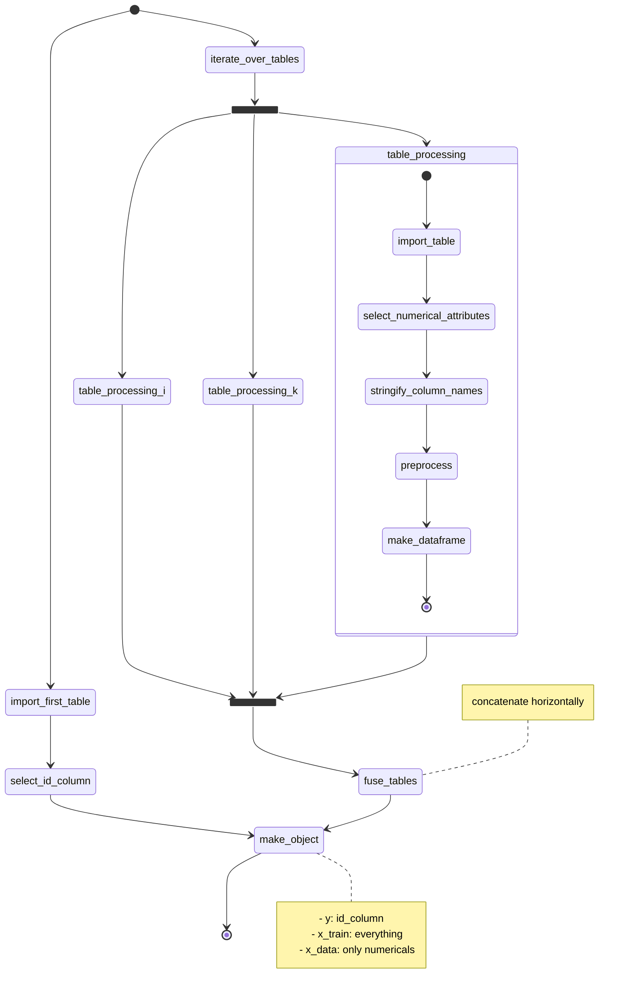

We are proud to release a new version of `chemfusekit`: `chemfusekitv1.2.0`. In this release, the low-level data fusion module was overhauled to allow for the joining of multiple tables.

<!-- truncate -->

## New LLDF module

Here is a diagram showing how the tables are imported and processed:

For each table:
- the table is imported
- only numerical attributes are selected (the class names are dropped)
- the column names are stringified

After importing all tables:
- tables are joined horizontally
- the class names are reimported from the first table and joined as the leftmost column

## Documentation updates

Documentation is now *versioned*. From now on, you will be able to view documentation for previous major releases along with the current documentation, in the `Docs` section.