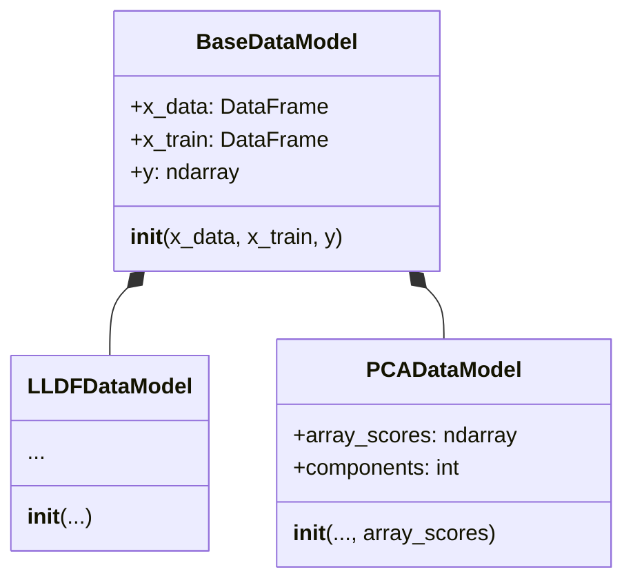
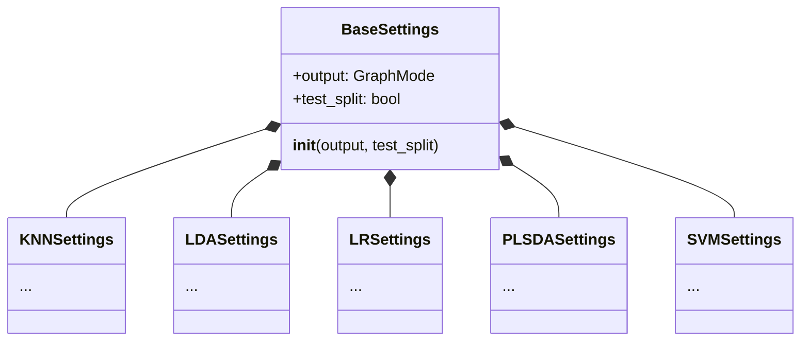
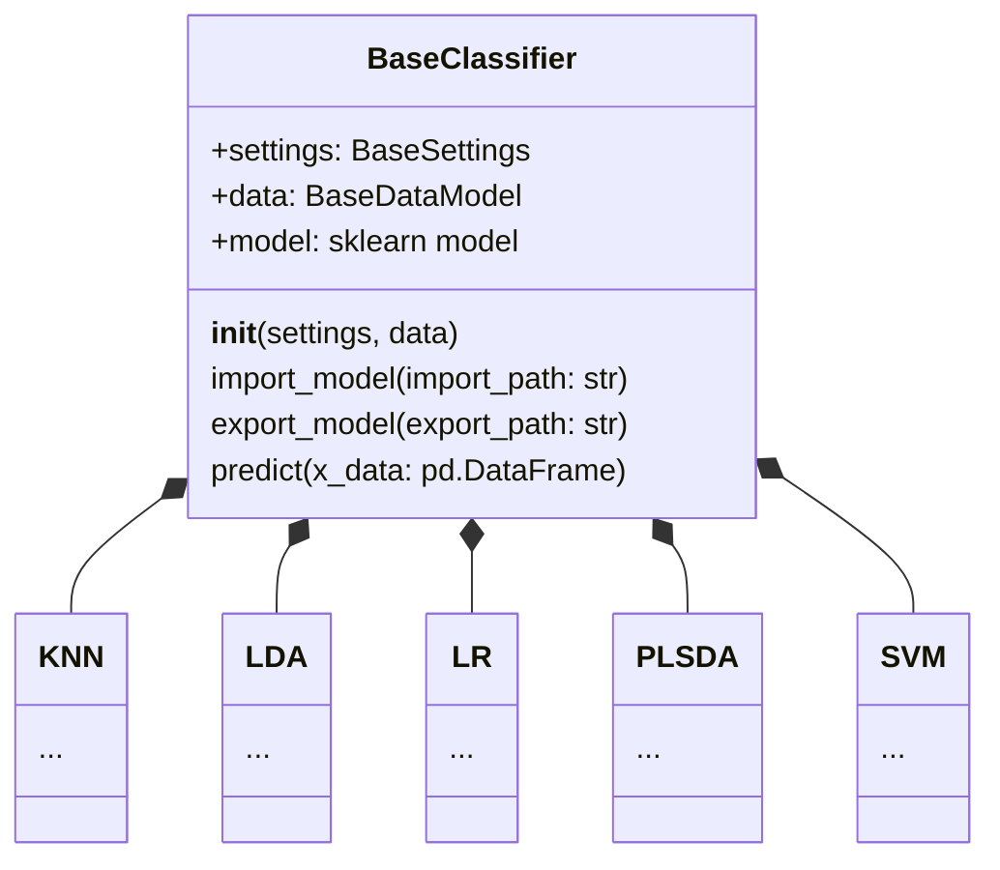

We are proud to release a new version of `chemfusekit`: `chemfusekitv2.0.0`.

In the ongoing pursuit of a more streamlined and structured project, we're excited to share the latest updates.

The `BaseDataModel` class now serves as the standard input for all classifiers. This versatile class is further extended by `PCADataModel`, the output of the `PCA` class, and `LLDFDataModel`, the output of the `LLDF` class.

We've also introduced smart adjustments for some classifiers based on the input type. For instance, `LDA` can now autonomously infer its own number of components if its input is a `PCADataModel`. Moreover, `LR` has been enhanced to predict from all types derived from `BaseDataModel`, eliminating the need for manual feeding of PCA outputs.

Inheritance from `BaseClassifier` is a new standard for all classifiers, with their settings inheriting from `BaseSettings`. The prediction process has been moved up the class hierarchy into `BaseClassifier`. Additionally, BaseClassifier introduces a new feature for all classifiers: the ability to import and export trained models to and from files.

We believe these changes will significantly improve the usability and consistency of the project. Stay tuned for more updates!

<!-- truncate -->

## BaseDataModel

Here is a diagram showing the inheritance structure for the `BaseDataModel`:

## BaseClassifier and BaseSettings

Here are some diagram showing the inheritance structure for `BaseSettings` and `BaseClassifier`:

