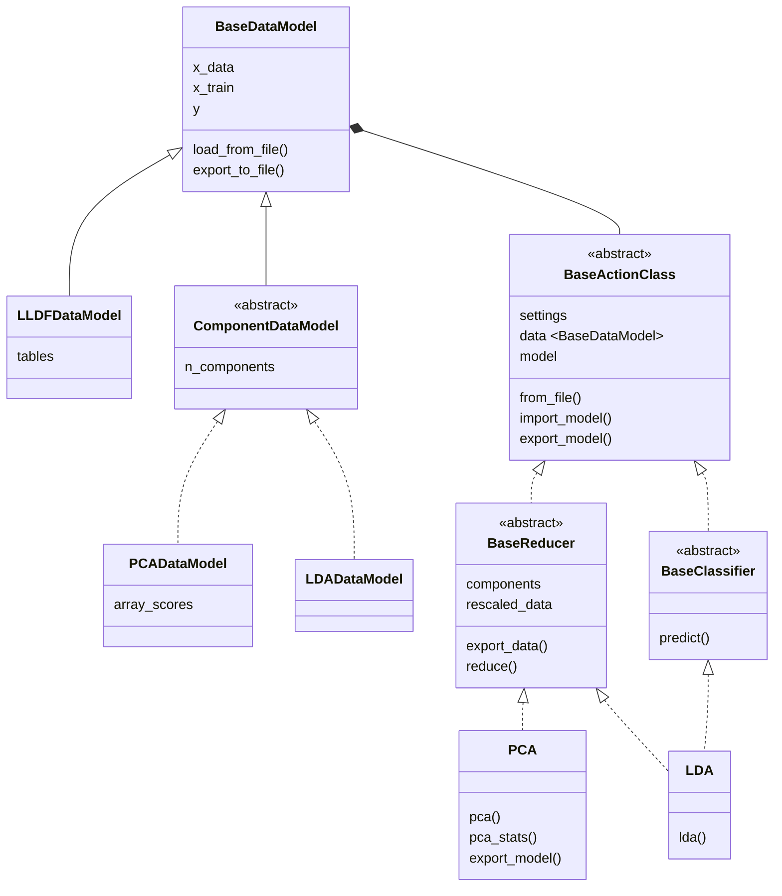

We are proud to release the last version of `chemfusekitv2.x.x`: `chemfusekitv2.5.0`.

This update tries to fix all that is fixable without breaking the structure, as well as make updates that increase the maintainability and streamlining of the processes, to prepare for `ChemFuseKitv3.x.x`.

<!-- truncate -->

## Changes and improvements

This is the new inheritance model for the library:

