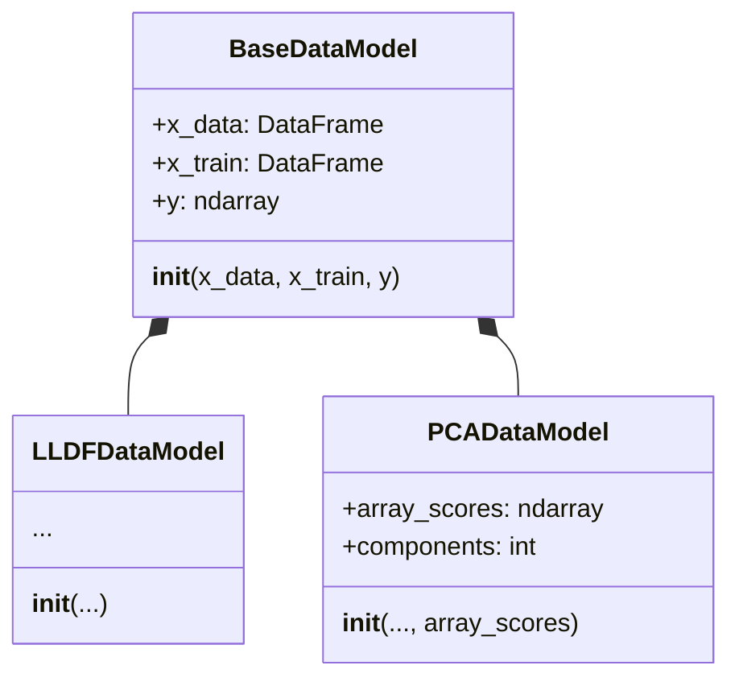
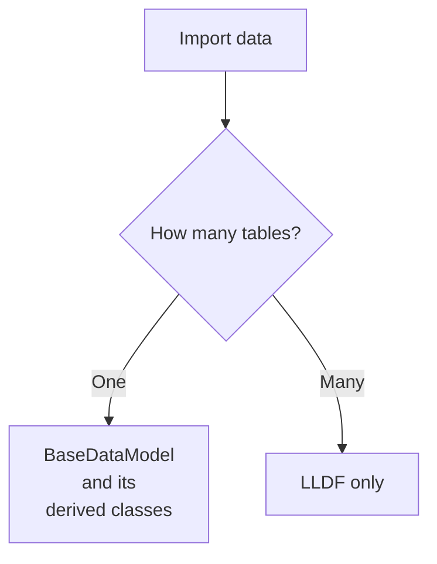

# 2. Data operations: import, export and data fusion

`ChemFuseKit` can elaborate datasets in multiple different ways.

For now, let's take a look at basic input / output operations on datasets. As stated in the previous chapter of this cookbook, all loaded datasets are contained into a `BaseDataModel` object or in one of its derived classes:



With the help of these classes, we can perform three fundamental data operations:

1. dataset loading
2. data fusion
3. dataset saving

## Dataset loading

`ChemFuseKit` can import Excel, CSV and JSON tables into its `BaseDataModel`-derived classes. `BaseDataModel` and both its derived classes offer the ability to import a single datasheet, while only `LLDF` (the name stands for *Low Level Data Fusion*) can perform data fusion by importing multiple tables at once into a single, unified dataset:



Let's say we have one single table, called `spectrometer_data.xlsx`, and we want to load it into our project, to then feed it to one of our classifiers.

This is the schema of the table contained in a sheet called `Spectral Samples` within `spectrometer_data.xlsx`:

| Sample number | Class           | 8     | 8.1   | 8.2   | 8.3    | ... | 9.9    | 10     |
|---------------|-----------------|-------|-------|-------|--------|-----|--------|--------|
| 1             | Dichloromethane | 2.341 | 3.866 | 1.430 | 5.843  |     | 0.032  | 1.128  |
| 2             | N-hexane        | 5.745 | 8.346 | 2.985 | 6.842  |     | 1.832  | 3.543  |
| 3             | Dioxane         | 0.003 | 0.002 | 0.006 | 0.0013 |     | 11.483 | 10.445 |
| ...           |                 |       |       |       |        |     |        |        |

As we can observe, there's an index column called *Sample number*, a class column called *Class* and then a certain number of columns containing the spectral responses of the samples in the 8nm - 10nm range.

<br />

Now, let's import this table into a `BaseDataModel`:

```python
from chemfusekit.__base import BaseDataModel

data = BaseDataModel.load_from_file(
    import_path='spectrometer_data.xlsx'
    sheet_name='Spectral samples',
    class_column='Class',
    index_column='Sample number'
)
```

Now our `data` variable is loaded, and, as an instance of `BaseDataModel`, it contains three fields:

- `x_data`
- `x_train`
- `y`

<br />

`x_data` is a Pandas Dataframe with the following content:

| 8     | 8.1   | 8.2   | 8.3    | ... | 9.9    | 10     |
|-------|-------|-------|--------|-----|--------|--------|
| 2.341 | 3.866 | 1.430 | 5.843  |     | 0.032  | 1.128  |
| 5.745 | 8.346 | 2.985 | 6.842  |     | 1.832  | 3.543  |
| 0.003 | 0.002 | 0.006 | 0.0013 |     | 11.483 | 10.445 |
| ...   |       |       |        |     |        |        |

As we can see, it only contains the spectral data.

<br />

`x_train`, a Pandas Dataframe too, contains both the classes (with the column header renamed to *Substance*) and the spectral data:

| Substance       | 8     | 8.1   | 8.2   | 8.3    | ... | 9.9    | 10     |
|-----------------|-------|-------|-------|--------|-----|--------|--------|
| Dichloromethane | 2.341 | 3.866 | 1.430 | 5.843  |     | 0.032  | 1.128  |
| N-hexane        | 5.745 | 8.346 | 2.985 | 6.842  |     | 1.832  | 3.543  |
| Dioxane         | 0.003 | 0.002 | 0.006 | 0.0013 |     | 11.483 | 10.445 |
| ...             |       |       |       |        |     |        |        |

<br />

`y`, a NumPy ndarray, only contains the classes (with the column header renamed to *Substance*):

| Substance       |
|-----------------|
| Dichloromethane |
| N-hexane        |
| Dioxane         |
| ...             |


## Data Fusion

:::warning
Data fusion operations only work if the different tables contain data from the same sample.

If we have two tables, the first row of the first table must contain data about the same sample as the first row in the second table, the second row of the first table must contain data about the same sample as the second row of the second table, and so on.

ChemFuseKit does not currently have any ability to realing misaligned data in different tables.
:::

Let's build on from the previous example. We have another file, `spectrometer_data.csv`, containing a table of chromatography data for the same samples of out previous table. We want to import it alongside our previous `Spectral samples` table.

This is the schema of the second table:

| Sample  | class           | Retention time |
|---------|-----------------|----------------|
| 1       | Dichloromethane | 123.78         |
| 2       | N-hexane        | 44.19          |
| 3       | Dioxane         | 22.34          |
| ...     |                 |                |

Even though the header names are slightly different, the content of the first two columns corresponds to the first two columns of the previous table. The third column contains gas chromatography retention times in milliseconds.

<br />

The `LLDF` module allows us to join these two tables (the current and the one from the previous examples) to form a single dataset that contains both spectral data and retention times. Let's see how.

```python
from chemfusekit.lldf import LLDFSettings, LLDF, GraphMode, Table

settings = LLDFSettings()   # Initialize the default settings

# Set up the import settings for the first table (spectral data)
table1 = Table(
    file_path='chemical_data.xlsx',
    sheet_name='Spectral samples',
    preprocessing='snv',
    class_column='Class',
    index_column='Sample number'
)

# Set up the import settings for the second table (chromatography data)
table2 = Table(
    file_path='chemical_data.csv',
    preprocessing='none',
    class_column='class',
    index_column='Sample'
)

# Now, let's make an array of the two tables
tables = [Table1, Table2]

# Let's pass the settings and the tables to the LLDF constructor
lldf = LLDF(settings, tables)

# Let's finally perform data fusion with the lldf() method!
lldf.lldf()
```

At the end of this cycle of operations, we can find our fused data object inside the `fused_data` property of our low-level data fusion object:

```python
lldf.fused_data
```

The `fused_data` field is of class `LLDFDataModel`, which is derived from `BaseDataModel`, and contains the same fields (`x_data`, `x_train`, `y`).

<br />

This is the content of `x_data` (a Pandas DataFrame):

| 8     | 8.1   | 8.2   | 8.3    | ... | 9.9    | 10     |Retention time |
|-------|-------|-------|--------|-----|--------|--------|---------------|
| 2.341 | 3.866 | 1.430 | 5.843  |     | 0.032  | 1.128  |123.78         |
| 5.745 | 8.346 | 2.985 | 6.842  |     | 1.832  | 3.543  |44.19          |
| 0.003 | 0.002 | 0.006 | 0.0013 |     | 11.483 | 10.445 |22.34          |
| ...   |       |       |        |     |        |        |               |

<br />

This is `x_train` (a Pandas DataFrame):

| Substance       | 8     | 8.1   | 8.2   | 8.3    | ... | 9.9    | 10     |Retention time |
|-----------------|-------|-------|-------|--------|-----|--------|--------|---------------|
| Dichloromethane | 2.341 | 3.866 | 1.430 | 5.843  |     | 0.032  | 1.128  |123.78         |
| N-hexane        | 5.745 | 8.346 | 2.985 | 6.842  |     | 1.832  | 3.543  |44.19          |
| Dioxane         | 0.003 | 0.002 | 0.006 | 0.0013 |     | 11.483 | 10.445 |22.34          |
| ...             | ...   |       |       |        |     |        |        |               |

<br />

This is the content of `y` (a NumPy ndarray):

| Substance       |
|-----------------|
| Dichloromethane |
| N-hexane        |
| Dioxane         |
| ...             |


## Dataset export

`BaseDataModel` and its derived classes have a `export_to_file` method that exports the complete table (class names and data columns) to an Excel, CSV or JSON file.

Let's say we want to export the fused dataset from the previous example into a file called `fused dataset.xlsx`. Here's how to do it, using our `lldf` variable from the previous example (the one that contained an instance of the `LLDF` class, with which we joined the two tables):

```python
lldf.export_to_file(export_path='fused dataset.xlsx', sheet_name="Sheet 1")
```

Et voila! Now we have a new file called `fused dataset.xlsx`, inside of which there is a sheet called "Sheet 1" with the following content:

| Substance       | 8     | 8.1   | 8.2   | 8.3    | ... | 9.9    | 10     |Retention time |
|-----------------|-------|-------|-------|--------|-----|--------|--------|---------------|
| Dichloromethane | 2.341 | 3.866 | 1.430 | 5.843  |     | 0.032  | 1.128  |123.78         |
| N-hexane        | 5.745 | 8.346 | 2.985 | 6.842  |     | 1.832  | 3.543  |44.19          |
| Dioxane         | 0.003 | 0.002 | 0.006 | 0.0013 |     | 11.483 | 10.445 |22.34          |
| ...             | ...   |       |       |        |     |        |        |               |

<br />

With this, you now know all the basics of data handling within `ChemFuseKit`.