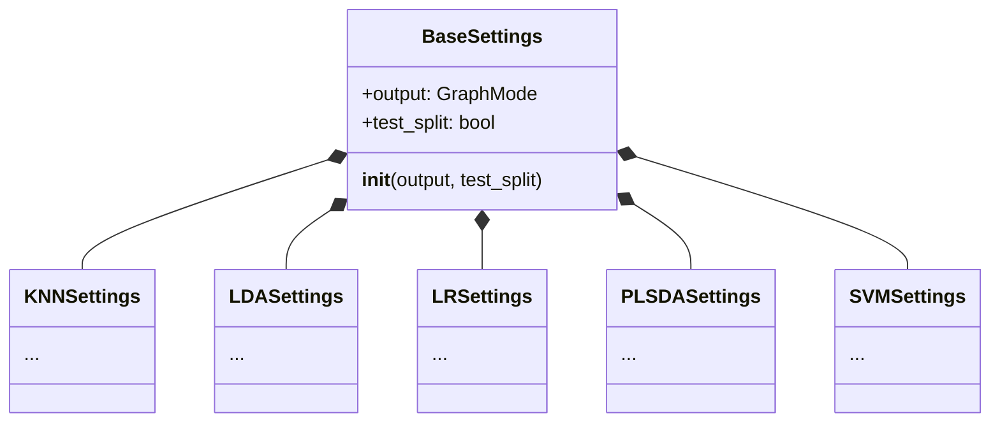
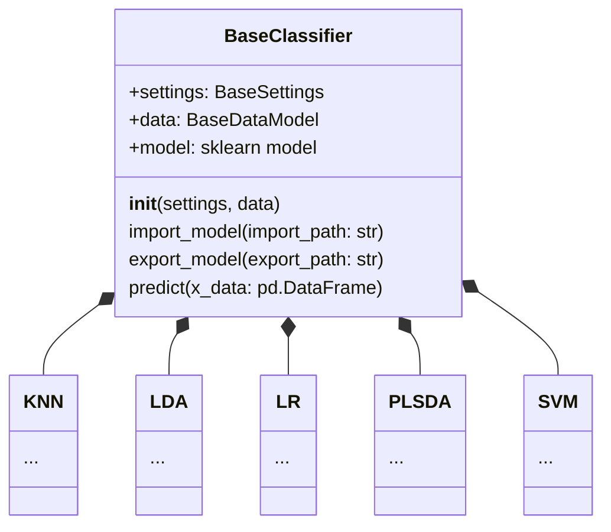
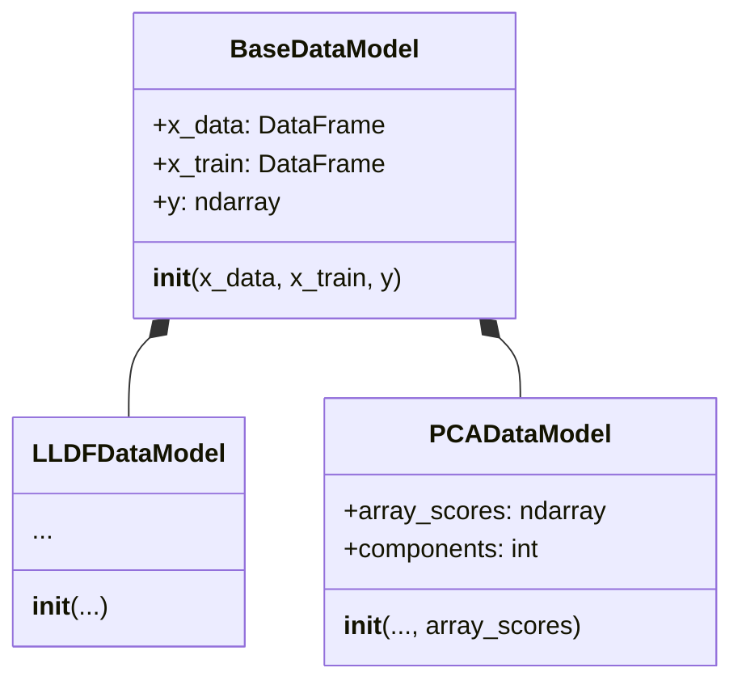

# Project structure

In this cookbook page, you will be shown how the project is structured, and the purpose of each module.

## Project Hierarchy

```
chemfusekit
 │
 ├── lda
 │    ├── LDASettings
 │    └── LDA
 │
 ├── lr
 │    ├── LRSettings
 │    └── LR
 │
 ├── plsda
 │    ├── PLSDASettings
 │    └── PLSDA
 │ 
 ├── pca
 │    ├── PCASettings
 │    ├── PCA
 │    └── PCADataModel
 │
 ├── lldf
 │    ├── LLDFSettings
 │    ├── LLDF
 │    └── LLDFDataModel
 │
 ├── svm
 │    ├── SVMSettings
 │    └── SVM
 │ 
 └── knn
      ├── KNNSettings
      └── KNN
```

As you can see, each module contains a class with the same name of the module, and a settings class. That's because this project tries to be as modular and as regular as possible, for clarity and interoperability.


## Modular design features

The settings for all classifiers (that is, all classes except `LLDF` and `PCA`) inherit from a base class called [`BaseSettings`](/docs/base/basesettings) in the `base` module:



\
\
The classifiers themselves all inherit from a base class called [`BaseClassifier`](/docs/base/baseclassifier) in the `base` module:



\
\
The data types are modular and interexchangeable too. Both [`LLDFDataModel`](/docs/lldf/lldfmodel) and [`PCADataModel`](/docs/pca/pcadatamodel) inherit from [`BaseDataModel`](/docs/base/basedatamodel) as shown in the following diagram:



This allows all the classifiers to use the `LLDF` data, dimension-reduced `PCA` data, or any other type of data as long as it follows the `BaseDataModel` template.