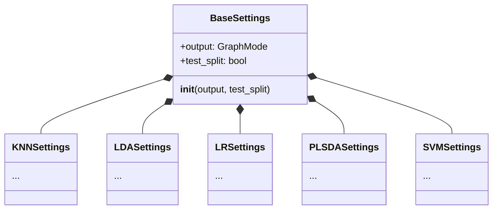
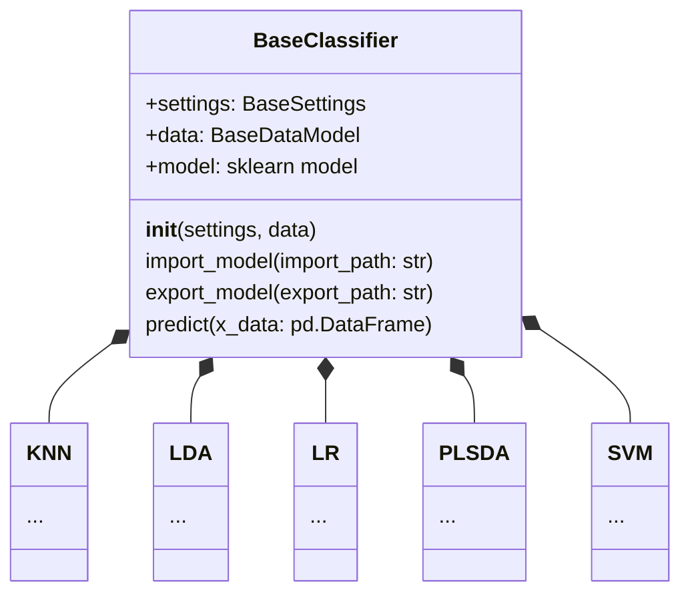
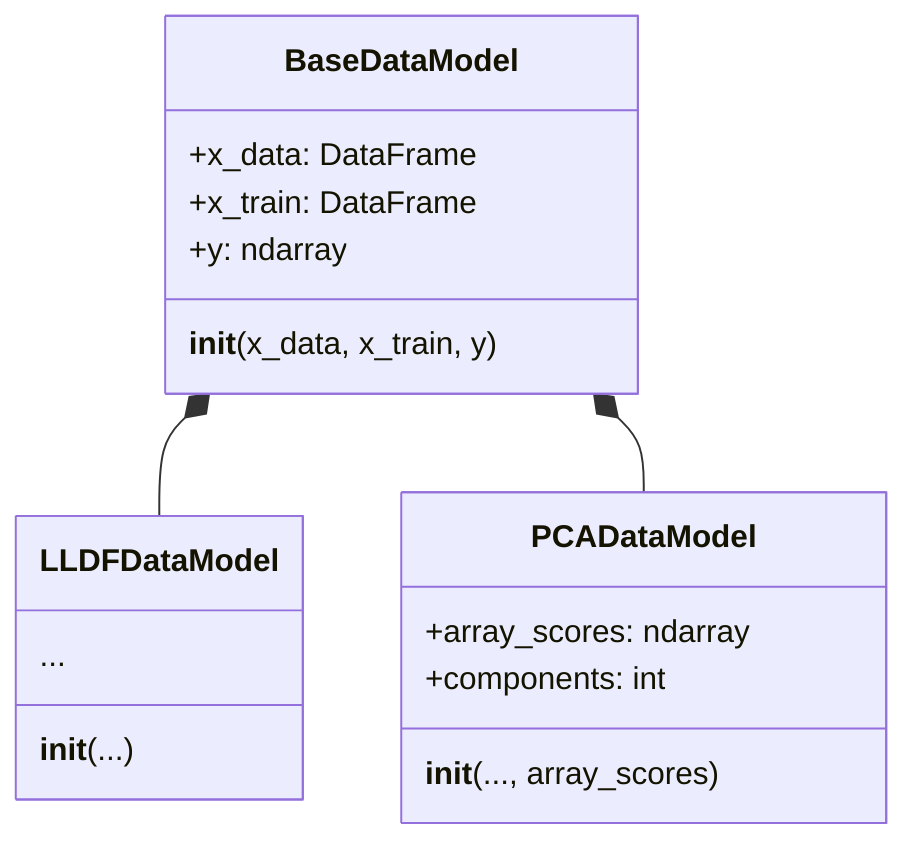

# Project structure

In this cookbook page, you will be shown how the project is structured, and the purpose of each module.

## Project Hierarchy

```
chemfusekit
 │
 ├── lda
 │    ├── LDASettings
 │    └── LDA
 │
 ├── lr
 │    ├── LRSettings
 │    └── LR
 │
 ├── plsda
 │    ├── PLSDASettings
 │    └── PLSDA
 │ 
 ├── pca
 │    ├── PCASettings
 │    ├── PCA
 │    └── PCADataModel
 │
 ├── lldf
 │    ├── LLDFSettings
 │    ├── LLDF
 │    └── LLDFDataModel
 │
 ├── svm
 │    ├── SVMSettings
 │    └── SVM
 │ 
 └── knn
      ├── KNNSettings
      └── KNN
```

As you can see, each module contains a class with the same name of the module, and a settings class. That's because this project tries to be as modular and as regular as possible, for clarity and interoperability.


## Modular design features

The entire library was streamlined to make operations as smooth and easy as possible. Any operation (import and export of both data and classifier models, training, processing, prediction, ...) looks the same on any class.

<br />

> *Want to update the settings in a classifier?*

You'll find the settings for `LDA` in `LDA.settings`. And the settings of `PCA` in `PCA.settings`. Where are the settings for `SVM`? In `SVM.settings`, of course. You get the hang of it.

<br />

> *Want to inspect the underlying `sklearn` model in one of the classifiers?

Let's say you're using a `LR` object. Its underlying sklearn classifier is in `LR.model`, as much as the underlying sklearn classifier of `KNN` is in `KNN.model`.

<br />

> *Want to swap out the data in a model and retrain it?*

Let's assume your new data is called `new_data`. Knowing that the training data, when present, is located in the `.data` field, just do this:

```python
knn.data = new_data
knn.knn()
```

The training method is always called like its container class, but in lower case. To train a `KNN` model, like in this case, you just have to call `.knn()` on it. Same goes for `.lda()` on `LDA`, `.lldf()` on `LLDF`, and so on.


### Modular settings

The settings for all classifiers (that is, all classes except `LLDF` and `PCA`) inherit from a base class called [`BaseSettings`](/docs/base/basesettings) in the `base` module:




### Modular classifiers

The classifiers themselves all inherit from a base class called [`BaseClassifier`](/docs/base/baseclassifier) in the `base` module:




### Modular data types

The data types are modular and interexchangeable too. Both [`LLDFDataModel`](/docs/lldf/lldfmodel) and [`PCADataModel`](/docs/pca/pcadatamodel) inherit from [`BaseDataModel`](/docs/base/basedatamodel) as shown in the following diagram:



This allows all the classifiers to use the `LLDF` data, dimension-reduced `PCA` data, or any other type of data as long as it follows the `BaseDataModel` template.

## File import and export

All the data models (`BaseDataModel`, and its derived, `LLDFDataModel` and `PCADataModel`) can export their content to Excel tables.

All classifiers derived from `BaseClassifier` (`KNN`, `LDA`, `LR`, `PLSDA`, `SVM`) can import and export their sklearn data model from and to file.