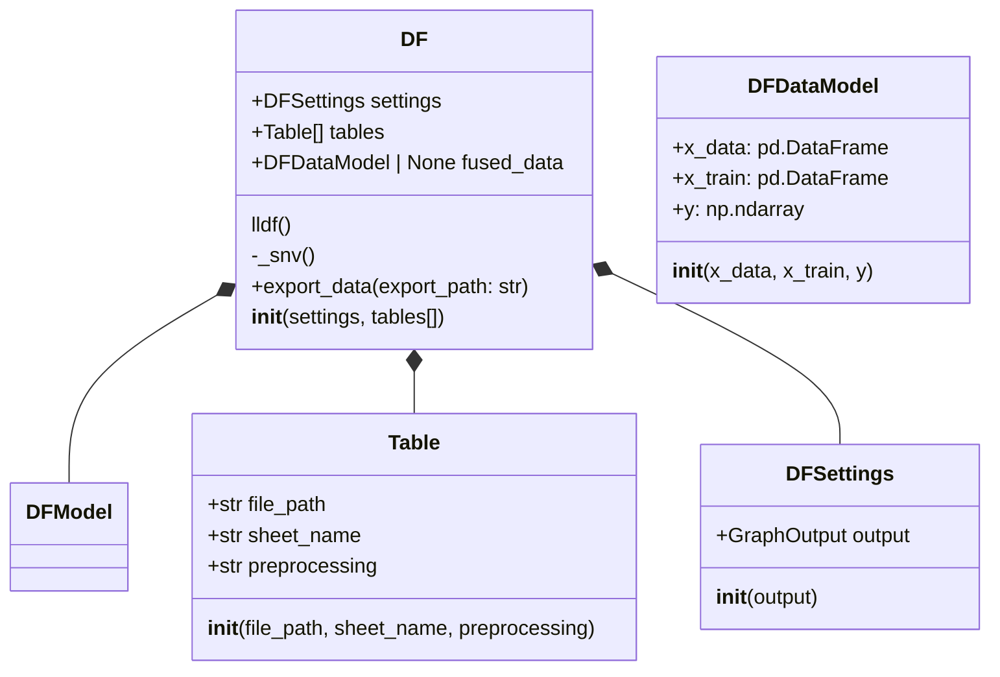

import DocCardList from '@theme/DocCardList';

# LLDF Module

A module for data fusion (low-level or mid-level).

# Members

<DocCardList />

# UML

```mermaid
classDiagram
    class Table {
        +str file_path
        +str sheet_name
        +str preprocessing
        __init__(file_path, sheet_name, preprocessing)
    }

    class DFSettings {
        +GraphOutput output
        __init__(output)
    }

    class DF {
        +DFSettings settings
        +Table[] tables
        +DFDataModel | None fused_data
        lldf()
        -_snv()
        +export_data(export_path: str)
        __init__(settings, tables[])
    }

    class DFDataModel {
        +x_data: pd.DataFrame
        +x_train: pd.DataFrame
        +y: np.ndarray
        __init__(x_data, x_train, y)
    }

    DF *-- DFModel
    DF *-- Table
    DF *-- DFSettings
```