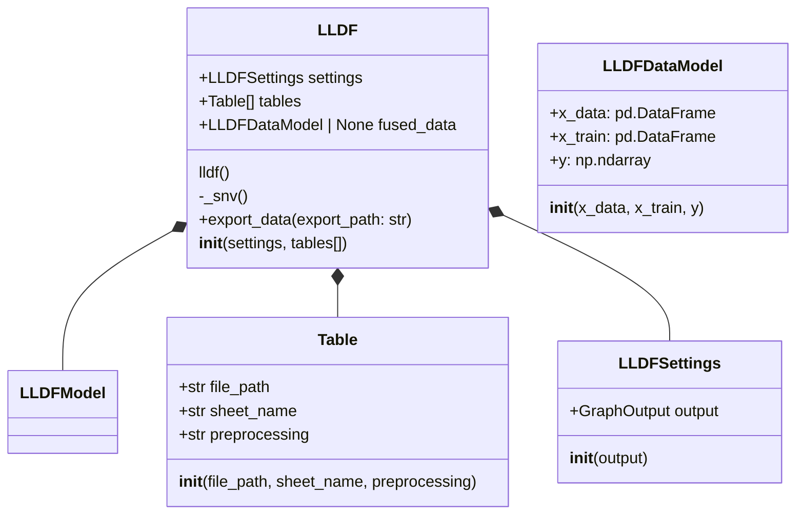

import DocCardList from '@theme/DocCardList';

# LLDF Module

A module for low-level data fusion.

# Members

<DocCardList />

# UML

```mermaid
classDiagram
    class Table {
        +str file_path
        +str sheet_name
        +str preprocessing
        __init__(file_path, sheet_name, preprocessing)
    }

    class LLDFSettings {
        +GraphOutput output
        __init__(output)
    }

    class LLDF {
        +LLDFSettings settings
        +Table[] tables
        +LLDFDataModel | None fused_data
        lldf()
        -_snv()
        +export_data(export_path: str)
        __init__(settings, tables[])
    }

    class LLDFDataModel {
        +x_data: pd.DataFrame
        +x_train: pd.DataFrame
        +y: np.ndarray
        __init__(x_data, x_train, y)
    }

    LLDF *-- LLDFModel
    LLDF *-- Table
    LLDF *-- LLDFSettings
```