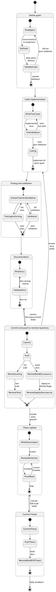

# Process Model

Here's a state machine diagram for the process followed during coding:

```plantuml
@startuml
[*] --> GoalsDefined

state "Define goals" as GoalsDefined {
	[*] --> ReadSpecs
	ReadSpecs --> SetGoals : choose feature\nto implement
	SetGoals --> ValidateGoals : daily sprint\ndefined
	ValidateGoals --> ReadSpecs : did not\npass validation
	ValidateGoals --> [*] : passed\nvalidation
}

GoalsDefined --> ImplementInCode

state "Code implementation" as ImplementInCode {
	[*] --> WriteTestCases
	WriteTestCases --> TestValidation : implemented\ntests
	TestValidation --> WriteTestCases : tests\nnot valid
	TestValidation --> Coding : tests\npass validation
	Coding --> [*] : implement all\nsprint goals
}

ImplementInCode --> TestAndValidate

state "Testing and validation" as TestAndValidate {
	[*] --> InitiateTestsAndValidation
	InitiateTestsAndValidation --> TestingAndLinting
    InitiateTestsAndValidation --> Validation
    TestingAndLinting --> InitiateTestsAndValidation : fail\ntests
    Validation --> InitiateTestsAndValidation : fail\nvalidation
    TestingAndLinting --> [*] : pass\ntests
    Validation --> [*] : pass\nvalidation
}

TestAndValidate --> Documentation

state Documentation {
    [*] --> WriteDocs
    WriteDocs --> ValidateDocs
    ValidateDocs --> WriteDocs : docs wrong:\nrewrite
    ValidateDocs --> [*] : docs ok
}

Documentation --> CommitRepo

state "Commit and push to remote repository" as CommitRepo {
	[*] --> Commit
	Commit --> Push
	Push --> RemoteLinting: lint\ncode 
	RemoteLinting --> RemoteTests : test\ncode
	Push --> RemoteBuildDocusaurus : build\ndocs
	RemoteTests --> [*]
	RemoteBuildDocusaurus --> RemoteDeployDocusaurus : deploy to\nGitHub Pages
	RemoteDeployDocusaurus --> [*]
}

CommitRepo --> ImplementInCode : remote\ntests\nfailed
CommitRepo --> Documentation : remote\nDocusaurus build\nfailed
CommitRepo --> ThesisUpdate : remote\ntests\npassed

state "Thesis update" as ThesisUpdate {
    [*] --> WriteDissertation
    WriteDissertation --> ReviewSentences : written
    ReviewSentences --> ProofRead : reviewed
    ProofRead --> ReviewSentences : correct\nmistakes
    ProofRead --> [*] : okay
}

ThesisUpdate --> CommitThs

state "Commit Thesis" as CommitThs {
	[*] --> CommitThesis
	CommitThesis --> PushThesis
	PushThesis --> RemoteBuildPDFThesis : build\ndocs
	RemoteBuildPDFThesis --> [*]
}

CommitThs --> ThesisUpdate : remote\nPDF build\nfailed
CommitThs --> [*] : Daily shutdown
@enduml
```