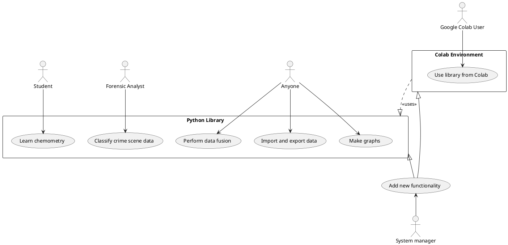

# Use case diagram

These are the main use cases for our data fusion and classification library:

```plantuml
@startuml
rectangle "Python Library" {
	(Learn chemometry)
	(Classify crime scene data)
	(Perform data fusion)
	(Import and export data)
	(Make graphs)
}

rectangle "Colab Environment" {
	(Use library from Colab)
}

(Add new functionality)

"Student" --> (Learn chemometry)
"Forensic Analyst" --> (Classify crime scene data)
"Anyone" --> (Perform data fusion)
"Anyone" --> (Import and export data)
"Anyone" --> (Make graphs)
"Google Colab User" --> (Use library from Colab)
"System manager" -up-> (Add new functionality)

"Colab Environment" ..|> "Python Library" : <<uses>>

(Add new functionality) -up-|> "Colab Environment"
(Add new functionality) -up-|> "Python Library"
@enduml
```
