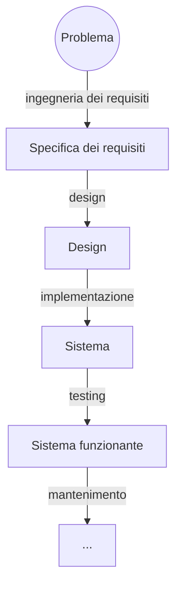

## Requisiti e processi

### Ingegneria dei requisiti

L'elicitazione dei requisiti è avvenuta durante una videochiamata con il dottor Giorgio Felizzato, durante le fasi iniziali del progetto. Una volta terminato lo sviluppo di un'applicazione desktop per la fusione dei dati multisensore da parte del tesista triennale Michele Verdi, è sorta la necessità di produrre un sistema di classificazione chemiometrica in grado di elaborare i risultati della fusione. Mentre Verdi lavorava alla propria applicazione, il dottor Felizzato ha creato diversi *notebook* che permettono la fusione dei dati, l'estrazione delle caratteristiche e la classificazione dei campioni. La sua soluzione era implementata senza riciclo di codice nelle sezioni ripetute tra uno *script* e l'altro. Di conseguenza è stato deciso di estrarne un software più modulare, che rendesse le analisi più agevoli, parametrizzabili e meno ripetitive. L'elenco delle soluzioni accettabili includeva un software desktop, un'applicazione web o anche una libreria da utilizzare nei *notebook*, a patto che il processo venisse modularizzato e reso più flessibile. Come requisito minimo, il software avrebbe dovuto contenere gli algoritmi impiegati nei *notebook* (PCA, PLSDA, LDA, LR, QDA, SVM, KNN). L'obiettivo iniziale per la creazione di ChemFuseKit, definito in tale sede, era dunque duplice, con l'intenzione di creare una soluzione ibrida, che non chiudesse le porte a futuri sviluppi in diverse possibili direzioni. In primo luogo, si desiderava estrarre una libreria di classificazione chemiometrica dai *notebook* del dottor Felizzato. In secondo luogo, ci si prefiggeva di costruire un'applicazione con interfaccia grafica basata sulla libreria estratta, per agevolarne l'uso. L'idea dell'applicazione grafica è stata ispirata da Spectra, una *web app* creata dall'Università di Torino. L'intento era di creare un'applicazione simile, che integrasse però l'opzione di analizzare dati da più sensori di più tipi, in contemporanea, per produrre la migliore possibile classificazione chemiometrica. È riportata di seguito una versione riordinata e tradotta dei punti chiave definiti nella specifica iniziale, disponibile in lingua inglese sul sito *web* della documentazione di ChemFuseKit:

> È necessario fornire la possibilità di salvare e caricare modelli addestrati, per tutti gli algoritmi che richiedano una fase di addestramento, con l'obiettivo di non doverla ripetere ad ogni uso. Tutti i risultati intermedi delle analisi, compresi i modelli addestrati, devono essere salvabili localmente, sul computer dell'utente. I dati, in particolare, devono essere salvabili come fogli di calcolo, per garantire l'interoperabilità con altri software quali Excel, Spectra e il progetto creato da Michele Verdi. Essendo destinata all'uso forense, il trattamento dei dati nell'applicazione deve essere rigoroso, e le analisi chemiometriche devono garantire la massima precisione. Per lo stesso motivo, se l'applicazione dovesse essere servita online, dovrebbe distruggere tutti i dati e tutti i risultati alla fine di ogni sessione di analisi. Dato che l'addestramento e l'utilizzo di modelli statistici sono compiti computazionalmente pesanti, l'eventuale componente grafica dell'applicazione dovrebbe essere quanto più leggera possibile, per non causare rallentamenti al software. La prima fase nella costruzione del progetto consiste nell'estrazione di una libreria dai *notebook* del dottor Felizzato. La seconda fase dovrebbe incentrarsi nell'implementazione di un'applicazione con interfaccia grafica. Sia la libreria che l'applicazione devono risultare estensibili, ma l'obiettivo più strettamente necessario riguarda la creazione di una libreria riutilizzabile. L'estrazione della libreria è un compito perfettamente realizzabile. La creazione dell'applicazione grafica, specialmente con requisiti così stringenti di manutenibilità ed espandibilità, risulta molto più complessa. Nel caso in cui quest'ultimo compito si riveli impossibile, una buona libreria senza interfaccia grafica sarà accettabile da sola. Nascendo come progetto di tesi triennale, l'applicazione non sarà mantenuta dal suo creatore originale, che avrà a disposizione un tempo limitato per lavorarci. Risulta dunque fondamentale renderla il più possibile ben strutturata, facilmente mantenibile e ampiamente documentata. Devono essere fornite le istruzioni d'uso, e rilasciata un'ampia ed estensiva documentazione su codice sorgente, struttura del progetto e algoritmi chemiometrici, per facilitare futuri aggiornamenti ed aggiustamenti. Come obiettivo aggiuntivo, il progetto dovrebbe risultare abbastanza semplice da consentire a non-programmatori, con capacità basiche nell'uso di Python, di modificarle le funzionalità esistenti o di aggiungerne di nuove.

### Ingegneria dei processi

In seguito alla produzione di una specifica dei requisiti, è stato composto un *project plan* a 14 punti, anch'esso disponibile sul sito web della documentazione del progetto. Il documento copre svariate aree, tra cui la definizione dei processi e degli standard, le linee guida, le finalità del progetto, i rischi, le persone coinvolte, i metodi per la garanzia della qualità, la suddivisione del lavoro, le risorse disponibili, la gestione dei cambiamenti e la metodologia di rilascio. I contenuti del project plan anticipano abbastanza realisticamente la struttura effettiva del lavoro. Fin da subito, ad esempio, è stata riconosciuta l'importanza di seguire lo schema definito dai *notebook* del dottor Felizzato minimizzando le scelte autonome. Ecco uno spezzone dal project plan, tradotto in italiano:

> Il modello dei processi prenderà alcuni concetti chiave dalla filosofia *Agile* mantenendo al contempo un approccio più rigoroso, per quanto possibile. Dato che il nucleo del sistema di classificazione è già definito negli *script* del dottor Felizzato, e che non ho alcuna esperienza pregressa con la chemiometria, tutti gli sforzi di *refactoring* dovranno necessariamente alterare il meno possibile il flusso di dati del codice originale.

Il punto più fondamentale, ampiamente rispettato, riguarda la procedura di lavoro basata sullo sviluppo incrementale. Come è ormai noto da decenni nella letteratura dell'ingegneria del software, è molto complesso riuscire a definire a priori come si svilupperà un progetto software, e uno sviluppo "a cascata" secondo passaggi e tempistiche predefinite è quasi sempre impossibile. Ecco come è stato definito il processo nel *project plan*:

> Lo sviluppo sarà incrementale: prima arriverà la libreria, e poi l'applicazione. Le tecniche di classificazione saranno aggiunte una per volta. Per garantire che almeno una parte del codice rimanga utilizzabile [per progetti futuri], la libreria necessita di essere perfettamente utilizzabile da sola, e di essere compatibile con Jupyter Notebook. Come è stato specificato in precedenza, altri studenti continueranno il progetto, che quindi deve essere documentato e modularizzato abbastanza bene da permettere ad altri mantenitori di costruire sopra di esso, specialmente sulla libreria, in caso l'applicazione grafica debba mai essere abbandonata.
Questo progetto prenderà anche alcune regole dal metodo dell'eXtreme Programming, principalmente gli *sprint* brevi o addirittura quotidiani, lo sviluppo guidato dai test e la *continuous integration*. Questo perché lo sviluppo sarà prevedibilmente discontinuo e difficile da tracciare; è di conseguenza fondamentale assicurarsi che una versione aggiornata e funzionante del software sia sempre disponibile, in caso lo sviluppo prenda una piega errata in qualche momento futuro.

Questa lungimiranza nel preparare un metodo di sviluppo che fosse immune a imprevisti e rallentamenti ha permesso di arrivare alla fine di questo progetto con una libreria funzionante, e di continuare a lavorarci fino all'ultimo minuto, nonostante tutti i problemi incontrati. Ecco quanto scritto nella sezione dei rischi:

> Un possibile rischio è non riuscire a terminare il software entro le scadenze imposte dalla mia (di Federico Aguzzi) laurea. Questo rischio sarà mitigato anteponendo la fase di estrazione della libreria così che almeno un componente utilizzabile possa essere prodotto da questo progetto, e implementando un approccio di *continuous integration* e di *build* quotidiane, che garantirà che una versione funzionante, seppur incompleta, sia disponibile ogni giorno.

Il massimo distacco tra *project plan* ed esecuzione si è misurato, non sorprendentemente, nei processi definiti con maggiore rigidità. L'intenzione iniziale di procedere incrementalmente, ben evidente in certe sezioni del *project plan*, veniva contraddetta in altri punti dalla direttiva di progettare a priori classi e processi con diagrammi UML, e di definire casi di test prima di iniziare l'implementazione del codice:

> Tutti i requisiti, casi d'uso e strutture delle classi per la libreria saranno progettate e rappresentate mediante grafici UML prima di iniziare a programmare.

L'idea è immediatamente fallita, vista l'estrema difficoltà nel progettare un sistema completo a inizio sviluppo, partendo peraltro da una scarsissima conoscenza del funzionamento dei classificatori. È stato impossibile definire a priori una struttura gerarchica e ordinata tra le diverse componenti, non riuscendo a riconoscere le fasi comuni tra i diversi *script*. Di conseguenza, nelle fasi iniziali dello sviluppo è stata implementata un'eccessiva quantità di soluzioni ad-hoc, successivamente rimosse e semplificate, che influivano negativamente sull'interoperabilità tra classificatori diversi. Il passare del tempo e l'avanzare dello sviluppo ha modificato ed espanso anche i casi d'uso. Da progetto iniziale, le capacità della libreria avrebbero dovuto essere incentrate all'analisi. Con l'avanzamento del progetto, il modulo di data fusion è finito per integrare funzionalità aggiuntive che lo rendono, per certi versi, più avanzato rispetto alla soluzione creata da Verdi. Un vero lavoro strutturato di progettazione per le classi è arrivato soltanto nelle ultime fasi dello sviluppo, durante la produzione della versione finale, quando si è resa evidente una struttura emergente comune a tutte le classi.

