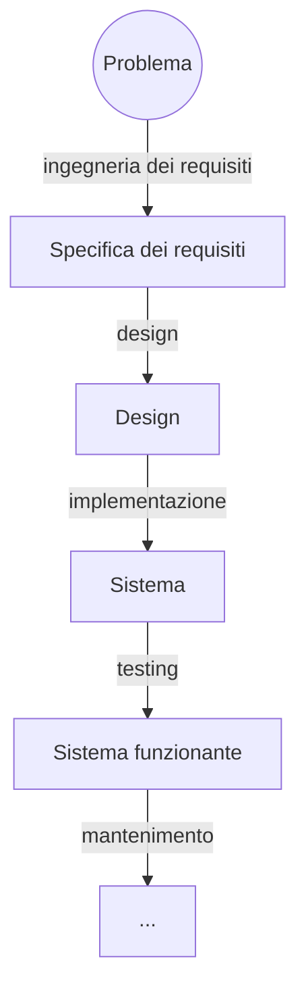
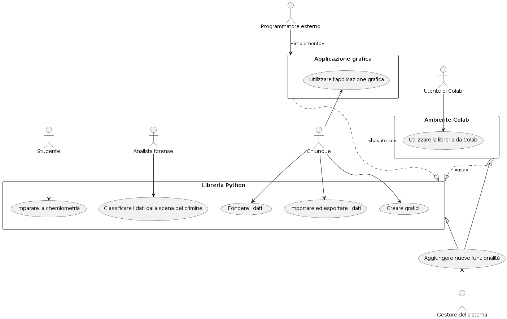
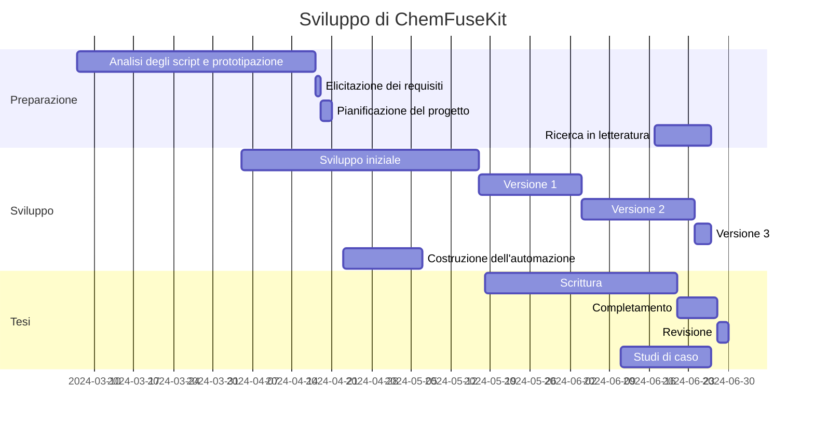
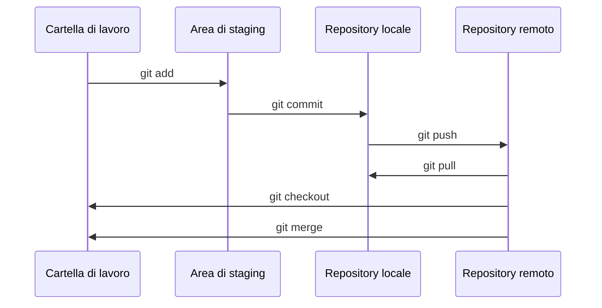

## Ingegneria dei requisiti

L'elicitazione dei requisiti è avvenuta durante una videochiamata con il dottor Giorgio Felizzato, durante le fasi iniziali del progetto. Una volta terminato lo sviluppo di un'applicazione desktop per la fusione dei dati multisensore da parte del tesista triennale Michele Verdi, è sorta la necessità di produrre un sistema di classificazione chemiometrica in grado di elaborare i risultati della fusione. Mentre Verdi lavorava alla propria applicazione, il dottor Felizzato ha creato diversi *notebook* che permettono la fusione dei dati, l'estrazione delle caratteristiche e la classificazione dei campioni. La sua soluzione era implementata senza riciclo di codice nelle sezioni ripetute tra uno *script* e l'altro. Di conseguenza è stato deciso di estrarne un software più modulare, che rendesse le analisi più agevoli, parametrizzabili e meno ripetitive. L'elenco delle soluzioni accettabili includeva un software desktop, un'applicazione web o anche una libreria da utilizzare nei *notebook*, a patto che il processo venisse modularizzato e reso più flessibile. Come requisito minimo, il software avrebbe dovuto contenere gli algoritmi impiegati nei *notebook* (PCA, PLSDA, LDA, LR, QDA, SVM, KNN). L'obiettivo iniziale per la creazione di ChemFuseKit, definito in tale sede, era dunque duplice, con l'intenzione di creare una soluzione ibrida, che non chiudesse le porte a futuri sviluppi in diverse possibili direzioni. In primo luogo, si desiderava estrarre una libreria di classificazione chemiometrica dai *notebook* del dottor Felizzato. In secondo luogo, ci si prefiggeva di costruire un'applicazione con interfaccia grafica basata sulla libreria estratta, per agevolarne l'uso. L'idea dell'applicazione grafica è stata ispirata da Spectra, una *web app* creata dall'Università di Torino. L'intento era di creare un'applicazione simile, che integrasse però l'opzione di analizzare dati da più sensori di più tipi, in contemporanea, per produrre la migliore possibile classificazione chemiometrica. È riportata di seguito una versione riordinata e tradotta dei punti chiave definiti nella specifica iniziale, disponibile in lingua inglese sul sito *web* della documentazione di ChemFuseKit:

> È necessario fornire la possibilità di salvare e caricare modelli addestrati, per tutti gli algoritmi che richiedano una fase di addestramento, con l'obiettivo di non doverla ripetere ad ogni uso. Tutti i risultati intermedi delle analisi, compresi i modelli addestrati, devono essere salvabili localmente, sul computer dell'utente. I dati, in particolare, devono essere salvabili come fogli di calcolo, per garantire l'interoperabilità con altri software quali Excel, Spectra e il progetto creato da Michele Verdi. Essendo destinata all'uso forense, il trattamento dei dati nell'applicazione deve essere rigoroso, e le analisi chemiometriche devono garantire la massima precisione. Per lo stesso motivo, se l'applicazione dovesse essere servita online, dovrebbe distruggere tutti i dati e tutti i risultati alla fine di ogni sessione di analisi. Dato che l'addestramento e l'utilizzo di modelli statistici sono compiti computazionalmente pesanti, l'eventuale componente grafica dell'applicazione dovrebbe essere quanto più leggera possibile, per non causare rallentamenti al software. La prima fase nella costruzione del progetto consiste nell'estrazione di una libreria dai *notebook* del dottor Felizzato. La seconda fase dovrebbe incentrarsi nell'implementazione di un'applicazione con interfaccia grafica. Sia la libreria che l'applicazione devono risultare estensibili, ma l'obiettivo più strettamente necessario riguarda la creazione di una libreria riutilizzabile. L'estrazione della libreria è un compito perfettamente realizzabile. La creazione dell'applicazione grafica, specialmente con requisiti così stringenti di manutenibilità ed espandibilità, risulta molto più complessa. Nel caso in cui quest'ultimo compito si riveli impossibile, una buona libreria senza interfaccia grafica sarà accettabile da sola. Nascendo come progetto di tesi triennale, l'applicazione non sarà mantenuta dal suo creatore originale, che avrà a disposizione un tempo limitato per lavorarci. Risulta dunque fondamentale renderla il più possibile ben strutturata, facilmente mantenibile e ampiamente documentata. Devono essere fornite le istruzioni d'uso, e rilasciata un'ampia ed estensiva documentazione su codice sorgente, struttura del progetto e algoritmi chemiometrici, per facilitare futuri aggiornamenti ed aggiustamenti. Come obiettivo aggiuntivo, il progetto dovrebbe risultare abbastanza semplice da consentire a non-programmatori, con capacità basiche nell'uso di Python, di modificarle le funzionalità esistenti o di aggiungerne di nuove.

## Project plan e ingegneria dei processi

In seguito alla produzione di una specifica dei requisiti, è stato composto un *project plan* a 14 punti, anch'esso disponibile sul sito web della documentazione del progetto. Il documento copre svariate aree, tra cui la definizione dei processi e degli standard, le linee guida, le finalità del progetto, i rischi, le persone coinvolte, i metodi per la garanzia della qualità, la suddivisione del lavoro, le risorse disponibili, la gestione dei cambiamenti e la metodologia di rilascio. I contenuti del project plan anticipano abbastanza realisticamente la struttura effettiva del lavoro. Fin da subito, ad esempio, è stata riconosciuta l'importanza di seguire lo schema definito dai *notebook* del dottor Felizzato minimizzando le scelte autonome. Ecco uno spezzone dal project plan, tradotto in italiano:

> Il modello dei processi prenderà alcuni concetti chiave dalla filosofia *Agile* mantenendo al contempo un approccio più rigoroso, per quanto possibile. Dato che il nucleo del sistema di classificazione è già definito negli *script* del dottor Felizzato, e che non ho alcuna esperienza pregressa con la chemiometria, tutti gli sforzi di *refactoring* dovranno necessariamente alterare il meno possibile il flusso di dati del codice originale.

Il punto più fondamentale, ampiamente rispettato, riguarda la procedura di lavoro basata sullo sviluppo incrementale. Come è ormai noto da decenni nella letteratura dell'ingegneria del software, è molto complesso riuscire a definire a priori come si svilupperà un progetto software, e uno sviluppo "a cascata" secondo passaggi e tempistiche predefinite è quasi sempre impossibile. Ecco come è stato definito il processo nel *project plan*:

> Lo sviluppo sarà incrementale: prima arriverà la libreria, e poi l'applicazione. Le tecniche di classificazione saranno aggiunte una per volta. Per garantire che almeno una parte del codice rimanga utilizzabile [per progetti futuri], la libreria necessita di essere perfettamente utilizzabile da sola, e di essere compatibile con Jupyter Notebook. Come è stato specificato in precedenza, altri studenti continueranno il progetto, che quindi deve essere documentato e modularizzato abbastanza bene da permettere ad altri mantenitori di costruire sopra di esso, specialmente sulla libreria, in caso l'applicazione grafica debba mai essere abbandonata.
Questo progetto prenderà anche alcune regole dal metodo dell'eXtreme Programming, principalmente gli *sprint* brevi o addirittura quotidiani, lo sviluppo guidato dai test e la *continuous integration*. Questo perché lo sviluppo sarà prevedibilmente discontinuo e difficile da tracciare; è di conseguenza fondamentale assicurarsi che una versione aggiornata e funzionante del software sia sempre disponibile, in caso lo sviluppo prenda una piega errata in qualche momento futuro.

Questa lungimiranza nel preparare un metodo di sviluppo che fosse immune a imprevisti e rallentamenti ha permesso di arrivare alla fine di questo progetto con una libreria funzionante, e di continuare a lavorarci fino all'ultimo minuto, nonostante tutti i problemi incontrati. Ecco quanto scritto nella sezione dei rischi:

> Un possibile rischio è non riuscire a terminare il software entro le scadenze imposte dalla mia (di Federico Aguzzi) laurea. Questo rischio sarà mitigato anteponendo la fase di estrazione della libreria così che almeno un componente utilizzabile possa essere prodotto da questo progetto, e implementando un approccio di *continuous integration* e di *build* quotidiane, che garantirà che una versione funzionante, seppur incompleta, sia disponibile ogni giorno.

Il massimo distacco tra *project plan* ed esecuzione si è misurato, non sorprendentemente, nei processi definiti con maggiore rigidità. L'intenzione iniziale di procedere incrementalmente, ben evidente in certe sezioni del *project plan*, veniva contraddetta in altri punti dalla direttiva di progettare a priori classi e processi con diagrammi UML, e di definire casi di test prima di iniziare l'implementazione del codice:

> Tutti i requisiti, casi d'uso e strutture delle classi per la libreria saranno progettate e rappresentate mediante grafici UML prima di iniziare a programmare.

L'idea è immediatamente fallita, vista l'estrema difficoltà nel progettare un sistema completo a inizio sviluppo, partendo peraltro da una scarsissima conoscenza del funzionamento dei classificatori. È stato impossibile definire a priori una struttura gerarchica e ordinata tra le diverse componenti, non riuscendo a riconoscere le fasi comuni tra i diversi *script*. Di conseguenza, nelle fasi iniziali dello sviluppo è stata implementata un'eccessiva quantità di soluzioni ad-hoc, successivamente rimosse e semplificate, che influivano negativamente sull'interoperabilità tra classificatori diversi. Il passare del tempo e l'avanzare dello sviluppo ha modificato ed espanso anche i casi d'uso. Da progetto iniziale, le capacità della libreria avrebbero dovuto essere incentrate all'analisi. Con l'avanzamento del progetto, il modulo di data fusion è finito per integrare funzionalità aggiuntive che lo rendono, per certi versi, più avanzato rispetto alla soluzione creata da Verdi. Un vero lavoro strutturato di progettazione per le classi è arrivato soltanto nelle ultime fasi dello sviluppo, durante la produzione della versione finale, quando si è resa evidente una struttura emergente comune a tutte le classi.

### I casi d'uso del progetto

I casi d'uso originali del progetto, definiti durante la costruzione della specifica originale, riguardano principalmente l'uso della libreria Python. Come precedentemente specificato, essa è stata pensata fin da subito per essere direttamente utilizzabile, senza bisogno di interfacce esterne. L'impiego tramite Google Colaboratory è stato considerato fin da subito come caso d'uso fondamentale. Questa scelta ha portato alla tempestiva pubblicazione della libreria su PyPI, e alla costruzione di un sistema di *continuous integration* per mantenere la versione pubblica costantemente aggiornata. Il caso d'uso della creazione di un'interfaccia grafica per la libreria è stato prima eliminato, e poi reintrodotto. alla luce dell'ultimo studio di caso nel presente documento di tesi. Si tratta in ogni caso di un caso d'uso disaccoppiato dalla libreria principale, per evitare la fossilizzazione di quest'ultima in un ambiente che possa ridurne l'utilizzabilità a lungo termine.

### Gestione dei rischi

Lo sviluppo del progetto ha richiesto l'assunzione di un approccio inusuale nei confronti del *feature creep*. Si definisce *feature creep* ("inflitrazione delle funzionalità") la tendenza dei progetti software a espandersi in ambito oltre i requisiti originali, portando spesso a ritardi, aumento dei costi e riduzione della qualità. Nonostante questa tendenza sia spesso vista come un problema nello sviluppo, a volte può essere l'unica risposta appropriata a cambiamenti nelle necessità. In questi casi, potrebbe rendersi necessario accettare il *feature creep* e costruire strategie per arginarne gli effetti indesiderati. Un approccio può consistere nell'implementazione di un sistema di *build* giornaliere. Questo permette allo sviluppatore di integrare e testare immediatamente le modifiche non appena vengono realizzate. In aggiunta, *refactor* periodici all'intero sistema possono aiutare a mantenere alta la qualità del *design* del sistema e a uniformare la struttura spesso caotica portata dalle continue aggiunte. Durante lo sviluppo di ChemFuseKit è stato presto evidente che sarebbe stato impossibile progettare il sistema a priori e mantenerne l'uniformità. Questa è stata ottenuta soltanto dopo molteplici ristrutturazioni che hanno portato a *breaking change* nella API della libreria. Un'altra situazione a cui è stato necessario fare l'abitudine è stata l'apparizione di nuovi casi d'uso, per cui ottimizzare la libreria, come proprietà emergenti delle *feature* aggiunte deliberatamente.

Un altro rischio riguarda la correttezza specifica delle analisi. Questa problematica era già stata evidenziata nel *project plan*:

> Un altro possibile rischio è creare un'applicazione o libreria che produca analisi scorrette dai dati forniti. Per mitigare il rischio, l'applicazione sarà controtestata con gli script originali del dott. Felizzato, e saranno condotti test rigorosi.

L’importazione, la fusione e l’analisi dei dati devono seguire linee guida stringenti nel contesto della chemiometria forense. I risultati, infatti, possono essere impiegati come prove in un processo. Per questo, i risultati devono essere calcolati rigorosamente, per massimizzare la probabilità della loro correttezza. Nell’estrema limitatezza d’ambito di questo piccolo progetto, non è possibile dare piena garanzia a priori del rispetto di queste condizioni. Risulta dunque fondamentale mantenere open source questo software; le motivazioni esposte di seguito potrebbero applicarsi in generale a tutti i programmi utilizzati per l’analisi forense. Rendere pubblici e facilmente accessibili sia il codice, che i dati di addestramento e i modelli di classificazione, permette di garantire verifiche trasparenti. Questo permette di contestare processualmente risultati incongruenti e analisi problematiche. Inoltre, esperti del settore possono valutare e verificare i metodi utilizzati, proponendo aggiustamenti, e contribuire ad aumentare la fiducia nei risultati ottenuti.

Si considerino infine gli ultimi due rischi. Uno di essi riguarda l’accettazione della libreria da parte dell’utente. Il programma deve seguire le aspettative e le necessità di analisti forensi e investigatori, che possono avere diversi gradi di abilità e conoscenze informatiche, nonché differenti preferenze metodologiche. L’uso della libreria non deve risultare eccessivamente complesso, e non deve forzare un flusso di lavoro eccessivamente rigido. Nello specifico di ChemFuseKit, si aggiungono le richieste della committenza interna. Alcune ristrutturazioni della libreria sono derivate da richieste di aggiustamento, dovute ad una difficile comprensione del metodo di utilizzo della prima iterazione della libreria. L’ultimo rischio riguarda le tempistiche di consegna della libreria completa. Come spiegato nella sezione sul project plan, è stato immediatamente chiaro, fin dalle prime fasi dello sviluppo, che la difficoltà nel predire la struttura del software avrebbe implicato una difficile predizione delle tempistiche di sviluppo. Per questo motivo il lavoro è stato diviso in fasi basate su blocchi di tempo, ed è proceduto incrementalmente, aggiugendo una sola funzionalità alla volta, testata, validata e documentata immediatamente. Questo accorgimento permette di avere una versione funzionante e aggiornata anche interrompendo improvvisamente lo sviluppo.

### Pianificazione temporale

Lo sviluppo di ChemFuseKit è stato pianificato in blocchi temporali parzialmente sovrapposti, per ottimizzare il tempo disponibile. La fase di preparazione si è concentrata principalmente nel mese di aprile. La prima iterazione è consistita nell’analisi degli script del dott. Felizzato. A seguire, sono stati condotti esperimenti di base e prove di concetto. Verso metà aprile è stata condotta l’elicitazione dei requisiti, seguita dalla specifica formale e dalla pianficazione del progetto. Lo sviluppo del codice si è concentato tra aprile e giugno, con fasi intense durante il mese di maggio. Parallelamente alla fase iniziale di sviluppo è avvenuta la costruzione del sistema di *continuous integration*. Il progresso del progetto è stato scandito dal rilascio di tre diverse serie di versioni. La scrittura della presente tesi si è concentrata nel mese di giugno, specialmente nella seconda metà. Parallelamente ad essa sono state condotte l’analisi della letteratura e la ricerca per gli studi di caso.

### Garanzia di qualità

La garanzia della qualità del *software* ha richiesto di seguire parallelamente due diverse strade. Uno dei due percorsi è stato basato sul seguire standard rigorosi per la scrittura del codice. Tramite la presenza di un *linter*, sia negli *editor* che sul *repository* remoto, sono stati imposti *standard* uniformi al codice. Le regole riguardano formattazione, imposizione dei nomi di variabili e metodi, modularizzazione del codice, struttura delle *docstring*, importazione di librerire esterne e altro. Il secondo percorso, parallelo al primo, ha riguardato la progressiva imposizione di un *design* uniforme. Il punto di partenza del progetto sono stati i *notebook* del dott. Felizzato, altamente specifici, *ad hoc* e non strutturati. Per progressivi passaggi di *refactoring*, si è proceduto fino all'ottenimento di un sistema modulare e strutturato, con un elevato grado di riutilizzo del codice. La modularizzazione del progetto ha facilitato il *debugging* e ha accresciuto la testabilità.

È stato fondamentale, ai fini del mantenimento di un buon livello di qualità, affidare i compiti più precisi ed elaborazionalmente complessi a librerie ben collaudate ed affidabili. Ad esempio, l’elaborazione statistica è stata gestita tramite Scikit-learn. L’algebra e l’elaborazione dei dati sono state condotte tramite Pandas e Numpy. Operazioni equivalenti, se implementate manualmente tramite funzionalità base di Python, avrebbero richiesto di scrivere codice più lungo e meno efficiente, più soggetto a *bug* e dal mantenimento molto meno agevole. Inoltre, le funzionalità più pesanti e complesse di queste librerie esterne sono implementate in linguaggio C altamente ottimizzato. Ciò permette un aumento significativo di velocità rispetto ad una soluzione in puro Python. Queste librerie sono inoltre supportate da una grande comunità di sviluppatori che risolve prontamente i bug e ottimizza le prestazioni. L’impiego di librerie diffuse, ben standardizzate e ben documentate rende infine il codice più comprensibile e manutenibile da esterni rispetto ad una soluzione completamente originale. Questo implica inoltre un significativo risparmio di tempo ed energie, con un conseguente miglioramento della produttività dello sviluppatore e un aumento della qualità complessiva del progetto.

### Testing e validazione

Per garantire qualità e affidabilità, durante lo sviluppo di ChemFuseKit è stato adottato un approccio di *testing* aggressivo. Per adattarsi all'idea delle *daily build*, è stato inserito nella procedura di *continuous integration* sul *repository* remoto anche un sistema per l'esecuzione dei test. Dato che il progetto prevede l'utilizzo di algoritmi statistici e di apprendimento automatico, le singole funzioni risultano difficili da testare singolarmente, se non confrontando i risultati delle loro elaborazioni con quelli di *software* esterno equivalente. Pertanto, il *testing* si è concentrato principalmente sulla validazione degli ingressi e sull'integrazione. Questo ha permesso di garantire l’interoperabilità tra i diversi moduli della libreria. Gli stessi casi di test erano eseguibili anche in locale, tramite un comando nel *build system*. Anche la validazione delle nuove funzionalità è stata inserita nel processo quotidiano di sviluppo. Eseguita ogni giorno insieme ai test, la validazione ha permesso di garantire completezza, correttezza e qualità del codice sviluppato in giornata. Questo ha portato all’eliminazione di funzionalità inutili o controproducenti, e al riallineamento di funzionalità non pienamente rispettose della specifica iniziale. La validazione costante ha inoltre permesso di mantenere il progetto tempestivamente allineato con le richieste dei responsabili del progetto. Una descrizione più tecnica del processo di *testing* è fornita in seguito, nella sezione che descrive in dettaglio le specificità implementative del progetto.

### Gestione della configurazione

Il *source control management*, noto anche come controllo di versione o controllo di revisione, è una pratica di sviluppo che segue e gestisce i cambiamenti al codice. Permette a più sviluppatori di lavorare allo stesso progetto senza sovrascrivere reciprocamente i cambiamenti, mantiene uno storico di tutte le modifiche e permette di ritornare a versioni precedenti del codice quando necessario. Questo facilita la collaborazione, la correzione di errori e lo sviluppo di nuove funzionalità. La versione principale dell'insieme dei *file* controllati dal sistema di controllo di versione si definisce *baseline*. Al suo interno rientrano il codice, la specifica dei requisiti, il *project plan*, la documentazione e altri tipi di risorse condivise tra gli sviluppatori, che possano cambiare nel tempo. Gli elementi contenuti nella *baseline* sono chiamati *configuration items*. Ogni proposta di cambiamento, chiamata *Change Request (CR)*, viene valutata da un team definito *Configuration Control Board (CCB)*. La *baseline* di questo progetto contiene il codice, i casi di test per il codice, gli esempi d'uso, i *case study*, la presente tesi, il progetto per il sito web della documentazione, la documentazione, i *file* di configurazione per il progetto python, i *file* di configurazione per le GitHub Actions. I principi del source control management, pensati per facilitare il lavoro in gruppo, rimangono parzialmente validi anche per lo sviluppo individuale, come nel caso del presente progetto. Avere un *repository* remoto permette di lavorare senza paura di perdere la copia locale. La possibilità di tornare ad uno stato precedente garantisce la possibilità di sperimentare con nuove aggiunte senza la paura di danneggiare irrimediabilmente il software. Lo storico mantenuto dalla lista delle versioni precendenti permette di ricordare la storia dello sviluppo senza doversela annotare esplicitamente. Infine, avere già pronto un sistema di versionamento predispone a future collaborazioni nel caso esse dovessero arrivare.

Per il presente progetto, è stato scelto di utilizzare il sistema di controllo di versione Git, un sistema di versionamento distribuito, ideato da Linus Torvalds, creatore di Linux, per facilitare lo sviluppo del suo kernel. I principi distintivi sono i seguenti. Ogni sviluppatore mantiene una copia locale dell'intero codice e della sua storia, che può modificare indipendentemente dagli altri. Il sistema crea una serie di istantanee della struttura del codice chiamate *commit*, contrariamente ad altre soluzioni, che registrano invece i cambiamenti ai singoli *file*. Questa particolarità rende git veloce ed efficiente, anche in presenza di codice di grandi dimensioni. Le modifiche locali rispetto al *commit* più recente sono contenute nell'area di *staging*. Lo sviluppatore può creare un nuovo *commit* dal contenuto dell'area di *staging*. Ogni *commit* è accompagnato da un titolo e ha un *hash* distintivo unico. I nuovi *commit* locali possono essere inviati al *repository* remoto in un'operazione chiamata *push*. L'operazione inversa, per scaricare i nuovi *commit* da remoto, si chiama *pull*. Git include degli strumenti per l'unione di cambiamenti al codice (*merge*), per la risoluzione dei conflitti e la comparazione tra versioni, nonché la possibilità di creare, gestire e fondere rami paralleli (*branch*) contenenti varianti del codice. L'uso dei *branch* nel *source control management* facilita lo sviluppo di nuove funzionalità sperimentali. Questo approccio permette di valutare e testare separatamente le nuove aggiunte senza compromettere il funzionamento della versione principale del *software*.

Il *repository* remoto per ChemFuseKit è situato su GitHub, una piattaforma in rete che fornisce servizi di *hosting* remoto per Git. Tra i servizi di *hosting* per Git, essa è la più usata e nota. Offre un'interfaccia per gestire il codice, seguire le *issue* (note pubbliche con cui gli utenti possono rivolgeri ai gestori del *repository* per fare domande, segnalare *bug* e proporre miglioramenti) e collaborare con altri sviluppatori. Un'altra funzionalità utile consiste nella possibilità di contribuire a progetti altrui. Chiunque può creare un *fork*, ovvero una copia non ufficiale di un progetto *open source*, modificarla autonomamente, e successivamente proporre l'inserimento delle proprie aggiunte nella versione centrale, tramite una procedura chiamata *pull request*. Oltre a strumenti per la collaborazione e la gestione dei progetti, GitHub offre agli sviluppatori un sistema di *Continuous Integration / Continuous Deployment (CI/CD)* chiamato GitHub Actions. Esso permette di automatizzare flussi di lavoro quali la compilazione, l'esecuzione dei test e la pubblicazione del codice, direttamente dal *repository* remoto. Gli sviluppatori possono impostare, tramite file di configurazione in formato YAML, azioni attivate automaticamente da certe condizioni (ad esempio, il *push* del codice sul *repository* remoto). Esiste un *marketplace* di azioni predefinite, liberamente utilizzabili e combinabili. In alternativa, l'utente può programmare le proprie. L'esecuzione avviene in un ambiente containerizzato basato su *Docker*. In questo progetto, le GitHub Actions sono state utilizzate per il *testing* e il controllo qualità del codice, per la pubblicazione automatica del sito web della documentazione e per la distrubuzione del *package* Python della libreria sul sistema PyPI.

Git non fornisce regole ufficiali per i messaggi di *commit*. Per questo progetto è stata scelta una specifica aperta chiamata Conventional Commits, introdotta dai suoi creatori come "una specifica per aggiungere significato leggibile da umani e da macchine ai messaggi di *commit*". Conventional Commits definisce due categorie fondamentali per i messaggi: `feat:`, per le implementazioni di nuove funzionalità, e `fix:`, per le soluzioni a *bug*. Altri tipi di messaggi includono `build:` (compilazione), `chore:` (lavori di impostazione o gestione delle dipendenze), `ci:` (tutto ciò che riguarda la *continuous integration*), `docs:` (documentazione), `style:` (formattazione stilistica), `refactor:` (formattazione funzionale), `perf:` (ottimizzazione delle prestazioni), e `test:` (*testing* del software). Lo standard consente di aggiungere un’indicazione generale dell’argomento del *commit* tra parentesi, tra il tipo e i due punti, ad esempio `feat(argomento):`. I commit che introducono *breaking change* possono essere indicati con un punto esclamativo nel titolo prima dei due punti o con `BREAKING CHANGE:` nel corpo del messaggio di *commit*. Le finalità dello standard comprendono l’automatizzazione della pubblicazione di *changelog* e di nuove *release* secondo la tecnica del rilascio semantico, descritta nella sezione su CI/CD.

