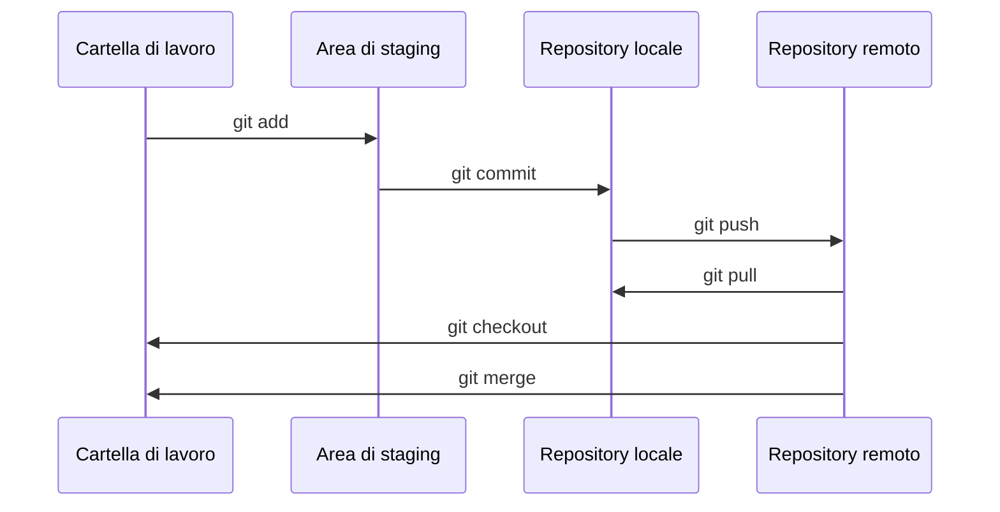

## Considerazioni tecniche

**SCRIVERE INTRODUZIONE**

### SCM

Il *source control management*, noto anche come controllo di versione o controllo di revisione, è una pratica di sviluppo che segue e gestisce i cambiamenti al codice. Permette a più sviluppatori di lavorare allo stesso progetto senza sovrascrivere reciprocamente i cambiamenti, mantiene uno storico di tutte le modifiche e permette di ritornare a versioni precedenti del codice quando necessario. Questo facilita la collaborazione, la correzione di errori e lo sviluppo di nuove funzionalità. La versione principale dell'insieme dei *file* controllati dal sistema di controllo di versione si definisce *baseline*. Al suo interno rientrano il codice, la specifica dei requisiti, il *project plan*, la documentazione e altri tipi di risorse condivise tra gli sviluppatori, che possano cambiare nel tempo. Gli elementi contenuti nella *baseline* sono chiamati *configuration items*. Ogni proposta di cambiamento, chiamata *Change Request (CR)*, viene valutata da un team definito *Configuration Control Board (CCB)*. La *baseline* di questo progetto contiene il codice, i casi di test per il codice, gli esempi d'uso, i *case study*, la presente tesi, il progetto per il sito web della documentazione, la documentazione, i *file* di configurazione per il progetto python, i *file* di configurazione per le GitHub Actions. I principi del source control management, pensati per facilitare il lavoro in gruppo, rimangono parzialmente validi anche per lo sviluppo individuale, come nel caso del presente progetto. Avere un *repository* remoto permette di lavorare senza paura di perdere la copia locale. La possibilità di tornare ad uno stato precedente garantisce la possibilità di sperimentare con nuove aggiunte senza la paura di danneggiare irrimediabilmente il software. Lo storico mantenuto dalla lista delle versioni precendenti permette di ricordare la storia dello sviluppo senza doversela annotare esplicitamente. Infine, avere già pronto un sistema di versionamento predispone a future collaborazioni nel caso esse dovessero arrivare.

Per il presente progetto, è stato scelto di utilizzare il sistema di controllo di versione Git, un sistema di versionamento distribuito, ideato da Linus Torvalds, creatore di Linux, per facilitare lo sviluppo del suo kernel. I principi distintivi sono i seguenti. Ogni sviluppatore mantiene una copia locale dell'intero codice e della sua storia, che può modificare indipendentemente dagli altri. Il sistema crea una serie di istantanee della struttura del codice chiamate *commit*, contrariamente ad altre soluzioni, che registrano invece i cambiamenti ai singoli *file*. Questa particolarità rende git veloce ed efficiente, anche in presenza di codice di grandi dimensioni. Le modifiche locali rispetto al *commit* più recente sono contenute nell'area di *staging*. Lo sviluppatore può creare un nuovo *commit* dal contenuto dell'area di *staging*. Ogni *commit* è accompagnato da un titolo e ha un *hash* distintivo unico. I nuovi *commit* locali possono essere inviati al *repository* remoto in un'operazione chiamata *push*. L'operazione inversa, per scaricare i nuovi *commit* da remoto, si chiama *pull*. Git include degli strumenti per l'unione di cambiamenti al codice (*merge*), per la risoluzione dei conflitti e la comparazione tra versioni, nonché la possibilità di creare, gestire e fondere rami paralleli (*branch*) contenenti varianti del codice. L'uso dei *branch* nel *source control management* facilita lo sviluppo di nuove funzionalità sperimentali. Questo approccio permette di valutare e testare separatamente le nuove aggiunte senza compromettere il funzionamento della versione principale del *software*.

Il *repository* remoto per ChemFuseKit è situato su GitHub, una piattaforma in rete che fornisce servizi di *hosting* remoto per Git. Tra i servizi di *hosting* per Git, essa è la più usata e nota. Offre un'interfaccia per gestire il codice, seguire le *issue* (note pubbliche con cui gli utenti possono rivolgeri ai gestori del *repository* per fare domande, segnalare *bug* e proporre miglioramenti) e collaborare con altri sviluppatori. Un'altra funzionalità utile consiste nella possibilità di contribuire a progetti altrui. Chiunque può creare un *fork*, ovvero una copia non ufficiale di un progetto *open source*, modificarla autonomamente, e successivamente proporre l'inserimento delle proprie aggiunte nella versione centrale, tramite una procedura chiamata *pull request*. Oltre a strumenti per la collaborazione e la gestione dei progetti, GitHub offre agli sviluppatori un sistema di *Continuous Integration / Continuous Deployment (CI/CD)* chiamato GitHub Actions. Esso permette di automatizzare flussi di lavoro quali la compilazione, l'esecuzione dei test e la pubblicazione del codice, direttamente dal *repository* remoto. Gli sviluppatori possono impostare, tramite file di configurazione in formato YAML, azioni attivate automaticamente da certe condizioni (ad esempio, il *push* del codice sul *repository* remoto). Esiste un *marketplace* di azioni predefinite, liberamente utilizzabili e combinabili. In alternativa, l'utente può programmare le proprie. L'esecuzione avviene in un ambiente containerizzato basato su *Docker*. In questo progetto, le GitHub Actions sono state utilizzate per il *testing* e il controllo qualità del codice, per la pubblicazione automatica del sito web della documentazione e per la distrubuzione del *package* Python della libreria sul sistema PyPI.

Git non fornisce regole ufficiali per i messaggi di commit. Per questo progetto è stata scelta una specifica aperta chiamata Conventional Commits, introdotta dai suoi creatori come "una specifica per aggiungere significato leggibile da umani e da macchine ai messaggi di *commit*". Conventional Commits definisce due categorie fondamentali per i messaggi: `feat:`, per le implementazioni di nuove funzionalità, e `fix:`, per le soluzioni a *bug*. Altri tipi di messaggi includono `build:` (compilazione), `chore:` (lavori di impostazione o gestione delle dipendenze), `ci:` (tutto ciò che riguarda la *continuous integration*), `docs:` (documentazione), `style:` (formattazione stilistica), `refactor:` (formattazione funzionale), `perf:` (ottimizzazione delle prestazioni), e `test:` (*testing* del software). Lo standard consente di aggiungere un’indicazione generale dell’argomento del *commit* tra parentesi, tra il tipo e i due punti, ad esempio `feat(argomento):`. I commit che introducono *breaking change* possono essere indicati con un punto esclamativo nel titolo prima dei due punti o con `BREAKING CHANGE:` nel corpo del messaggio di *commit*. Le finalità dello standard comprendono l’automatizzazione della pubblicazione di *changelog* e di nuove *release* secondo la tecnica del rilascio semantico, descritta nella sezione su CI/CD.

### Linguaggio

Il progetto si basa sugli script sviluppati dal dottor Felizzato utilizzando Jupyter Notebook. La scelta del linguaggio Python è stata dunque ovvia. Python è un linguaggio di programmazione interpretato, dinamico e multipiattaforma, ampiamente utilizzato in ambito scientifico e di analisi dei dati. La sua sintassi semplice e leggibile, unita alla disponibilità di numerose librerie specializzate, lo rendono una scelta ideale per lo sviluppo di applicazioni di elaborazione dati. In particolare, le librerie utilizzate nel progetto, come NumPy, Pandas, Scikit-learn e Matplotlib, sono tra le più diffuse e consolidate nell'ambito dell'analisi dei dati. La scelta di riutilizzare logica e codice degli script del dottor Felizzato ovunque possibile ha permesso di minimizzare la possibilità di errori metodologici nell'analisi, garantendo inoltre una maggiore efficienza nello sviluppo del progetto. La scelta di Python come linguaggio di programmazione rende il progetto facilmente accessibile e modificabile da altri ricercatori in futuro. L'istanza del progetto RISEN portata avanti in questo ateneo richiede la continuazione del lavoro tra più tesisti e di conseguenza il riciclo parziale del codice.

#### Standard di codice

Per il codice Python è stato scelto di seguire il più possibile lo standard PEP 8, definito nel 2001 da Guido Van Rossum, creatore del linguaggio. Le regole principali impongono l'utilizzo di quattro spazi per l'indentazione, l'utilizzo dello snake case per i nomi delle variabili e delle funzioni, all caps per le costanti, lunghezza massima delle righe di 79 caratteri, a capo allineati per gli argomenti delle funzioni. Ulteriori regole stilistiche sono state imposte utilizzando il *linter* Pylint, descritto separatamente in seguito. L'implementazione della libreria si basa anche sullo standard PEP 484 del 2015, che ha introdotto un sistema di suggerimenti di tipo sia per le variabili, che per parametri e ritorni delle funzioni. Viene inoltre parzialmente rispettato lo standard PEP 257 del 2001, che definisce le modalità di scrittura delle *docstring*. Si tratta di annotazioni, posizionate tra l'intestazione di classi o metodi e i loro corpi, e poi trasformate automaticamente in suggerimenti visibili agli utenti del software. I tipi più elaborati di *docstring* contengono informazioni dettagliate su parametri e ritorni, mentre la versione base, utilizzata in questa libreria, fornisce soltanto una breve descrizione dello scopo del metodo o della classe.

### Librerie usate

La scelta di riutilizzare logica e codice degli *script* del dottor Felizzato ovunque possibile non ha influenzato solamente la scelta del linguaggio, come esposto in precedenza, ma anche delle librerie. Va comunque sottolineato che tutte le librerie impiegate all'interno di ChemFuseKit, con l'eccezione di una (BearType), sono ampiamente utilizzate in un ampio numero di progetti di elaborazione dati, e la loro scelta sarebbe risultata abbastanza scontata anche in assenza del modello fornito dai *notebook* del dottor Felizzato. Ad esempio, la libreria NumPy è una delle librerie più utilizzate per la gestione di array e matrici in Python, mentre Scikit-learn fornisce una vasta gamma di algoritmi per la scienza dei dati e l'ingegneria. Inoltre, la libreria Pandas è diventata uno standard de facto per la manipolazione e l'analisi dei dati in Python, grazie alla sua capacità di gestire dati strutturati e non strutturati in modo efficiente. Infine, la libreria Matplotlib è ampiamente utilizzata per la visualizzazione dei dati in Python, fornendo una vasta gamma di strumenti per creare grafici e diagrammi di alta qualità. La scelta di queste librerie ha garantito non solo la compatibilità con gli *script* esistenti del dottor Felizzato, ma anche la solidità e l'affidabilità del codice di ChemFuseKit.

Gli algoritmi presenti nel software provengono da scikit-learn, una nota e affidabile libreria di statistica e *machine learning*. Per questo, i suoi classificatori sono di alta qualità e rappresentano lo stato dell'arte per la loro precisione e ottimizzazione. La libreria fornisce un'ampia gamma di algoritmi per compiti di classificazione, regressione, *clustering*, riduzione della dimensionalità e selezione delle caratteristiche. Scikit-learn è costruito su altre librerie Python come NumPy, SciPy e Matplotlib, ed è progettato per interoperare con esse per l'elaborazione e la visualizzazione dei dati. La libreria è nota per la sua facilità d'uso, la documentazione di alta qualità e l'interfaccia uniforme per la costruzione, l'addestramento e la valutazione dei modelli di machine learning. Scikit-learn è ampiamente utilizzata nella ricerca accademica e nell'industria per lo sviluppo di applicazioni di apprendimento automatico, grazie alla sua robustezza, flessibilità e scalabilità.

Per il trattamento delle tabelle dei dati sono state utilizzate due librerie molto note, NumPy e Pandas. NumPy è una libreria open source per Python, utilizzata per la manipolazione di vettori e matrici di dati numerici. NumPy fornisce una vasta gamma di funzioni matematiche e statistiche per operare su array multidimensionali, tra cui operazioni di algebra lineare, calcolo di statistiche, trasformate di Fourier e molto altro. Gli algoritmi della libreria sono implementati in C, il che la rende estremamente veloce ed efficiente nell'esecuzione di calcoli numerici complessi. Grazie alla sua flessibilità e alla sua facilità d'uso, NumPy è diventata una delle librerie più utilizzate nella comunità scientifica e di apprendimento automatico di Python, ed è spesso utilizzata come base per altre librerie di alto livello come SciPy e pandas. Pandas è un'altra libreria open source per il linguaggio di programmazione Python, utilizzata per la manipolazione e l'analisi di dati strutturati. In particolare, Pandas fornisce strutture dati efficienti e flessibili per gestire tabelle di dati a due dimensioni, come ad esempio tabelle Excel, file CSV o database SQL. La libreria offre una vasta gamma di funzionalità per la pulizia, la trasformazione, la fusione e e il filtraggio dei dati, nonché strumenti avanzati per la gestione di serie temporali e dati categorici. Grazie alla sua sintassi intuitiva e alla sua compatibilità con altre librerie Python come NumPy e Matplotlib, anche Pandas è diventata una delle librerie più utilizzate nell'ambito dell'analisi dei dati e del *machine learning*.

Per garantire una tipizzazione più forte e ridurre gli errori nel progetto, è stata introdotta fin dall'inizio la libreria esterna BearType. BearType è un type checker di terza generazione, che combina il type checking statico durante la programmazione con il type checking dinamico in esecuzione. La libreria è programmata in Rust per garantire la massima leggerezza durante l'esecuzione dinamica. In caso di mancato rispetto dei tipi indicati, BearType lancia un `TypeError`. L'utilizzo di BearType ha permesso di semplificare e alleggerire i controlli di tipo nei costruttori, aggirando il sistema di tipizzazione nativo di Python, noto come *duck type*. Il nome è un riferimento ad un'espressione in lingua inglese: *"if it looks like a duck, swims like a duck, and quacks like a duck, then it probably is a duck"*, che significa "se sembra un'anatra, nuota come un'anatra e starnazza come un'anatra, allora è probabilmente un'anatra". Nell'ambito Python, questo significa che la runtime del lunguaggio solleva errori di tipo solo quando il comportamento esterno di un oggetto è incompatibile con le procedure adottate nel codice, un comportamento inadeguato per le esigenze del presente progetto. La scelta di BearType è stata quindi motivata dalla necessità di una tipizzazione più forte, in grado di ridurre gli errori e garantire una maggiore affidabilità del codice.

Unittest è una libreria integrata in Python per l'esecuzione di test automatici, ispirata al modello xUnit per gli *unit test*. Il modello, introdotto originariamente per il sistema sUnit di Smalltalk, si basa su principi chiave come la scrittura di test per singoli metodi, la raccolta di test in casi e suite, l'esecuzione automatica dei test e la scrittura di test slegati dalle specificità del sistema e dotati di condizioni ripetibili. Nel caso di questo progetto è risultato difficile testare singolarmente le funzioni, perché l'*output* è statistico e fortemente legato al funzionamento esterno di Scikit-learn. Pertanto, la forma più utile di testing applicata in questo progetto è stata la validazione degli input, gestita da BearType, e il testing di integrazione, per verificare il mantenimento dell'interoperabilità tra le diverse componenti della libreria al suo espandersi e modificarsi. L'utilizzo di test remoti automatizzati tramite GitHub Actions ha permesso di applicare il principio delle *daily build*, spiegato in seguito, che permette di mantenere sempre disponibile una versione della libreria costantemente aggiornata e funzionante.

Pylint è un noto strumento di analisi statica per il codice Python, atto a migliorare la qualità del codicem e imporre standard come il precedentemente menzionato PEP 8. I suoi controlli riguardano una grande quantità di parametri, tra cui errori sintattici, variabili inutilizzate e le convenzioni per i nomi. Oltre a segnalare gli errori e i problemi, Pylint assegna un voto da 0 a 10 alla qualità del codice. Pylint è altamente configurabile e permette di personalizzare le regole di analisi in base alle proprie esigenze. Ad esempio, è possibile disabilitare alcune regole o definire eccezioni per determinate righe di codice. Inoltre, Pylint fornisce suggerimenti per migliorare il codice, come ad esempio l'eliminazione di codice ridondante o la semplificazione di espressioni complesse. L'utilizzo di Pylint nel progetto ha permesso di mantenere un codice pulito, leggibile e conforme agli standard, facilitando la manutenzione e l'estensione del codice stesso. Esso è stato integrato nel progetto tramite un workflow di *continuous integration* da remoto che fallisce se il codice analizzato riceve un voto inferiore a 8.

#### Ambiente di sviluppo e strumenti

Lo sviluppo del progetto è avvenuto in un ambiente di esecuzione isolato per Python, ottenuto tramite Rye. Questa soluzione è descritta più dettagliatamente nella prossima sezione. Il codice è stato scritto parzialmente con PyCharm Community Edition, e parzialmente con VSCodium. PyCharm Community Edition è un ambiente di sviluppo integrato (*Integrated Development Enviromnment*, IDE), specializzato per il linguaggio Python e sviluppato da JetBrains. Fornisce strumenti per la modifica del codice, per il *debugging*, per l'esecuzione dei test, per il controllo di versione e per la gestione dei progetti. Supporta nativamente *framework* di sviluppo *web* basati su Python come Django, Flask e Pyramid. Include un emulatore di terminale, strumenti per i database e funzioni di sviluppo remoto. Ne esiste una versione commerciale (PyCharm Professional) con funzionalità aggiuntive. VSCodium è una variante *open source* di VSCode, noto *editor* sviluppato da Microsoft. Al contrario della versione standard, non contiene un sistema di telemetria. È compatibile con le estensioni per VSCode e, come Pycharm, contiene un terminale integrato e un sistema di debugging. Al contrario del software di JetBrains, VSCodium non è pensato esplicitamente per il linguaggio Python, e richiede estensioni per supportarlo in modo completo. Una di esse è Pylance, un *language server* open source che supporta il *type checking* e l'autocompletamento. La scelta di utilizzare entrambi gli *editor* deriva dalle limitazioni di entrambi. PyCharm offre un sistema di suggerimenti e correzioni molto più rapido e intelligente rispetto alla soluzione di VSCode, ma non supporta nativamente il formato Jupyter Notebook usato per costruire gli esempi e i *case study*. Lo sviluppo principale della libreria è avvenuto in PyCharm, così come il *testing* e il *debugging*. Quest'ultimo compito è stato facilitato dall'integrazione del debugger PyDev, con la possibilità di specificare i *breakpoint* direttamente nell'*editor* del codice. La scrittura dei *notebook* e dei *case study* è stata condotta in VSCodium. Quest'ultimo, essendo un *editor* generico, si adatta anche alla programmazione *web*, ed è dunque stato impiegato per lo sviluppo del sito per la documentazione.

### Documentazione

Per la scrittura e la pubblicazione della documentazione è stato scelto di impiegare Docusaurus, un progetto *open source* di Meta per la costruzione di siti web specializzati per questo scopo. Docusaurus consente di scrivere i documenti in Markdown e di compilare automaticamente il sito web come versione statica distribuibile. Questo strumento è basato su React e offre diversi *plugin* per inserire diagrammi, schemi, blocchi di codice, ricerche interne e altri elementi. Inoltre, Docusaurus supporta il versionamento dei documenti. L'utilizzo di Docusaurus ha permesso di automatizzare parzialmente il processo di pubblicazione della documentazione, rendendola facilmente accessibile agli utenti finali e garantendo la sua coerenza con il codice sorgente. Il progetto di Docusaurus, contenuto nella *baseline*, è compilato e pubblicato sulle GitHub Pages mediante GitHub Actions. La documentazione è stata divisa seguendo la stessa struttura dei moduli del codice, ed è scritta a livello di classe. Per ogni classe vengono elencati campi, metodi e parametri, insieme a considerazioni funzionali e, dove possibile, ad esempi di utilizzo. Inoltre, insieme alla documentazione è disponibile un "ricettario" contenente delucidazioni generali sulla struttura del progetto e sull'integrazione tra moduli, abbinate ad esempi e casi d'uso reali. Altre sezioni del sito di documentazione sono un *blog* in cui vengono pubblicate informazioni sulle nuove versioni della libreria al momento del loro rilascio, e una pagina contenente i documenti come specifica dei requisiti e *project plan*.

### Build System e CI/CD

Come sistema di gestione delle dipendenze e di compilazione dei package è stata scelta Rye, una libreria di recente pubblicazione. Essa si distingue per la sua velocità e affidabilità, grazie all'uso del linguaggio Rust per la sua implementazione. Inoltre, la sua conformità agli standard PEP garantisce la compatibilità con altri strumenti e librerie Python. Rye utilizza un file di configurazione in formato TOML per definire le dipendenze del progetto e le impostazioni di compilazione. Grazie all'uso di un ambiente di sviluppo isolato, Rye evita conflitti tra le dipendenze dei diversi progetti e garantisce la riproducibilità dell'ambiente di sviluppo. Inoltre, Rye supporta la pubblicazione dei package su diversi repository, tra cui PyPI, il repository ufficiale dei package Python. L'integrazione di Rye con le GitHub Actions ha permesso di automatizzare il processo di distribuzione e pubblicazione del package di ChemFuseKit, garantendo che ogni nuova versione fosse rilasciata in modo sicuro e affidabile.

Il progetto traccia le proprie versioni impiegando una tecnica nota come semantic versioning, che divide il rilascio in versioni maggiori (con novità che rompono la struttura corrente), versioni minori (novità non distruttive) e versioni correttive (per la risoluzione di bug). Ogni versione è distinta da un nome contenente tre numeri nel formato `MAJOR.MINOR.PATCH`, dove le modifiche incompatibili incrementano il numero `MAJOR`, le nuove funzionalità incrementano il numero `MINOR` e le correzioni di *bug* incrementano il numero `PATCH`. L'aumento di una delle tre sezioni azzera le parti alla sua destra. Il numero di ogni sezione può aumentare indefinitamente. In questo progetto, il rilascio delle nuove versioni è gestito automaticamente da un bot basato sulle GitHub Actions, regolato dall'attività in specifici branch e dal contenuto dei messaggi di commit. Questi messaggi seguono lo standard Conventional Commits, descritto in precedenza nella sezione riguardante il *source control management*. I *commit* marchiati con un `!` o con `BREAKING CHANGE` avviano il rilascio di una versione maggiore, quelli segnati come `feat:` avviano il rilascio di versioni minori, e quelli di tipo `fix:` avviano il rilascio di versioni correttive. Al rilascio di ogni nuova versione, il bot pubblica su GitHub un *changelog* che indica tutte le novità e correzioni presenti nella versione. I *commit* e i *merge* sul *branch* `main` del *repository* remoto attivano il rilascio di versioni nel canale principale, mentre le operazioni equivalenti sul *branch* chiamato `pre/beta` rilasciano versioni sul canale di sviluppo, contenente versioni sperimentali marchiate come *beta*.

In questo progetto, ogni azione può essere attivata da condizioni specifiche, oppure da modifiche al suo *file* di configurazione. I test sono attivati da modifiche al codice o ai casi di test, il *linting* è attivato da modifiche al codice, ed entrambi sono attivi su tutti i *branch*. L'azione di *release* è attivata in conseguenza di *push* o *merge* sui branch `main` o `pre/beta`, secondo le modalità descritte nel paragrafo precedente. I prodotti di tale azione sono pubblicati sia su PyPI, sia su GitHub in abbinamento al *changelog*. L'azione di compilazione e rilascio del progetto Docusaurus è attivata soltanto da modifiche ad esso nel `main`. Il progetto è rilasciato sulle GitHub pages, un servizio di hosting statico fornito da GitHub per la pubblicazione di siti web direttamente da repository. L'utilizzo di un metodo di lavoro che integri tutte queste azioni contribuisce alla buona riuscita dello sviluppo di ChemFuseKit, secondo i principi di *daily build* discussi in precedenza.

