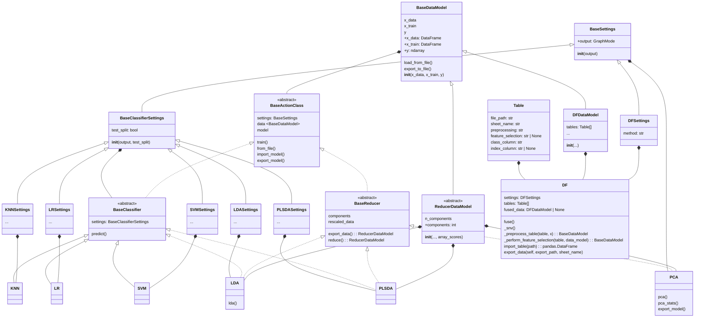
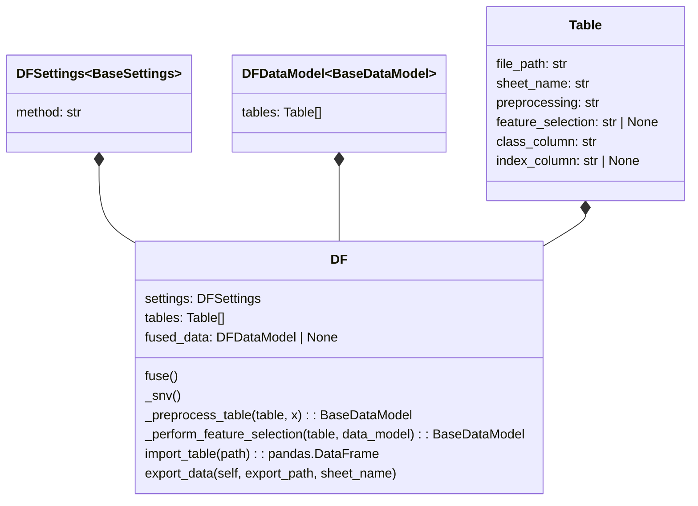
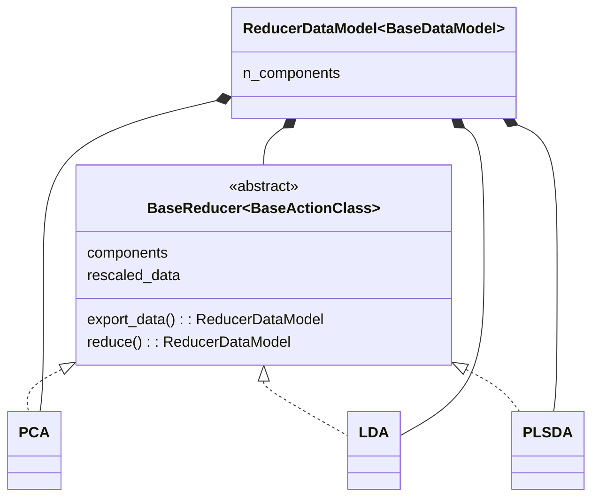
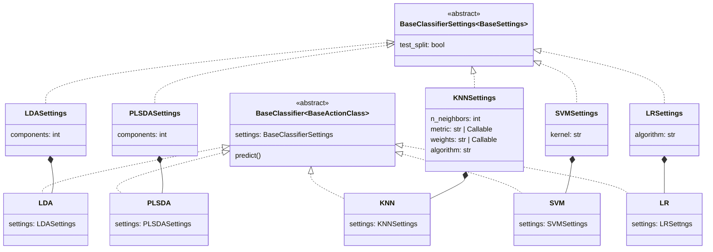

## Dettagli implementativi

Questa sezione descrive la struttura finale assunta da ChemFuseKit, a livello di design e di implementazione. Sono omesse le numerose modifiche effettuate nelle fasi intermedie dello sviluppo. La scelta deriva dall’entità delle continue ristrutturazioni. Si ricorda che la libreria ha attraversato, nel corso del suo sviluppo, tre gruppi di breaking change, come testimoniato dalla numerazione semantica. Avviamo ora le considerazioni generali sulla struttura del progetto. La struttura della libreria è ereditaria e le classi si dividono in modelli per i dati, classificatori, riduttori di dimensionalità e oggetti di impostazioni. Il modulo per la fusione di dati, unico nella sua categoria, è a sé stante. Le classi presentano una parziale struttura comune anche quando appartenenti a famiglie diverse. Per migliorare la manutenibilità e minimizzare la quantità totale di codice nella libreria, la maggior quantità possibile di procedure e sottoprocedure è stata spostata nelle superclassi. Inoltre, tutte le classi derivanti da una stessa superclasse sono uniformi nella loro interfaccia. Questo permette l’interoperabilità tra classi dello stesso tipo. Ogni classificatore può sostitutire ogni altro classificatore, e ogni riduttore può sostituire qualsiasi altro riduttore.

### Modulo di fusione dei dati

Il modulo di fusione dei dati è la parte più unica e innovativa di ChemFuseKit. È l’unico ad essere costruito su operazioni elementari invece di basarsi su funzioni pre-esistenti delle librerie usate come dipendenze. Questo modulo contiene una classe per la fusione dei dati (`DF`, *Data Fusion*), una classe di impostazioni (`DFSettings`), una classe per rappresentare le tabelle importate (`Table`) e una classe per rappresentare gli oggetti di output (`DFDataModel`). Le impostazioni in `DFSettings` permettono di selezionare il tipo di *output* (grafico, *plain text* o nessuno) e l'algoritmo di fusione da usare. Il primo possibile algoritmo, `concatenate`, si basa sulla semplice concatenazione orizzontale delle tabelle, campione per campione. Il secondo algoritmo, `outer`, è basato sulla moltiplicazione diadica tra matrici (*outer product* in inglese). Questa seconda forma di fusione permette di compensare, in alcuni casi, la differenza di dimensionalità tra i campioni di sensori diversi. Campioni a bassa dimensionalità, infatti, rischiano di essere diluiti da campioni a dimensionalità maggiore. Un'altra possibile tecnica per la mitigazione di questo problema è la fusione di dati a medio livello, spiegata più avanti.

Ogni tabella di dati da importare è rappresentata da una struttura di dati di classe `Table`. Gli oggetti di classe `Table` relativi alle tabelle da fondere sono raccolti in un vettore, da passare come parametro al costruttore dell'oggetto `DF`. Tramite `Table` è possibile specificare il percorso del file, l'eventuale nome del foglio al suo interno, i nomi della colonna indice e della colonna di categoria, il tipo di preprocessamento e l'operazione di selezione delle caratteristiche. I tipi di processamento disponibili sono la normalizzazione SNV (opzione `snv`), lo smussamento di Savitski-Golay (opzione `savgol`), la combinazine di entrambe le operazioni (opzione `savgol+snv`), oppure nessuna operazione (opzione `none`). Un'altra opzione riguarda la possibilità di effettuare selezione delle caratteristiche, con due possibili algoritmi, PCA (opzione `pca`) o PLSDA (opzione `plsda`). La selezione del numero di caratteristiche estratte è automatizzata per entrambi gli algoritmi. Nel caso di PCA, questa scelta è basata sul tentativo di spiegare il 95% della varianza nei dati usando il minor numero possibile di componenti principali. Nel caso di PLSDA, invece, la decisione è effettuata mediante validazione incrociata a cinque pieghe. È la scelta di effettuare o meno la selezione delle caratteristiche a distinguere il tipo di operazione di fusione dei dati. L'unione di tabelle non ridotte si definisce fusione a basso livello, mentre l'unione delle caratteristiche estratte è chiamata fusione a medio livello. I vantaggi e gli svantaggi di entrambi gli approcci sono affrontati nel *case study* corrispondente.

### Riduttori di dimensionalità

Tutte le classi con capacità di selezione delle caratteristiche discendono dalla superclasse astratta `BaseReducer`. Essa, a sua volta, deriva da `BaseActionClass`, da cui eredita i metodi per l'addestramento, l'importazione e l'esportazione dei modelli. Una volta caricato o addestrato un modello, gli oggetti di questa categoria sono in grado di ridurre la dimensionalità dei dati. Le tre classi di questa capacità, al momento della scrittura, sono `PCA`, `LDA` e `PLSDA`. `LDA` e `PLSDA` sono anche in grado di agire come classificatori. La selezione del numero di caratteristiche in `PCA` è dettata da un valore di soglia per la varianza spiegata dal modello. Per `PLSDA` e `LDA`, invece, la scelta del numero di caratteristiche viene effettuata tramite validazione incrociata a cinque pieghe. Questa scelta automatica viene effettuata se e solo se non è specificato un numero di componenti nelle impostazioni. In caso contrario, il numero scelto viene imposto al modello.

Le classi di riduzione della dimensionalità presentano diverse opzioni per esportare e processare i dati. Possono innanzitutto esportare le caratteristiche estratte dai dati di addestramento del loro modello (proprietà `rescaled_data`). In alternativa, possono esportare i dati di addestramento, non processati, in una struttura dati che li abbina al numero di caratteristiche estratte (metodo `export_data`). Questa opzione risulta utile in flussi di lavoro ibridi, come ad esempio quando si utilizza il numero di componenti determinato dall'analisi PCA per scegliere le componenti dell'algoritmo LDA. Una terza possibilità per il processamento dei dati è la selezione delle caratteristiche in tabelle terze che abbiano lo stesso numero di colonne dei campioni usati nell'addestramento (metodo `rescale`). Quest'ultima opzione è utile per preprocessare le tabelle provenienti dagli stessi sensori usati per produrre i dati di addestramento.

### Classificatori

Tutti i moduli con capacità di classificazione discendono dalla superclasse astratta `BaseClassifier`. A sua volta, `BaseClassifier` discende dalla superclasse astratta `BaseActionClass`. Da essa eredita i metodi per addestrare, importare ed esportare i modelli di classificazione. Tutti i classificatori sono in grado di effettuare inferenza sui dati in ingresso, che si tratti di singoli campioni o blocchi. Affinché questo sia possibile, i dati da classificare devono mantenere la stessa struttura, e soprattutto la stessa dimensionalità dei campioni usati per l'addestramento dei modelli. I classificatori implementati al momento della scrittura sono `LDA` (analisi discriminante lineare), `SVM` (macchina a vettori di supporto), `KNN` (primi k-vicini), `PLSDA` (analisi discriminante ai quadrati minimi parziali) e `LR` (regressione logistica). Ciascun classificatore ha i propri punti di forza e di debolezza, e può essere usato in contesti diversi a seconda delle esigenze specifiche. L’ereditarietà da una classe comune permette ad ogni classificatore di essere sostituito con un qualsiasi altro durante l’analisi. Questo permette di testare con facilità tecniche di classificazione differenti.

