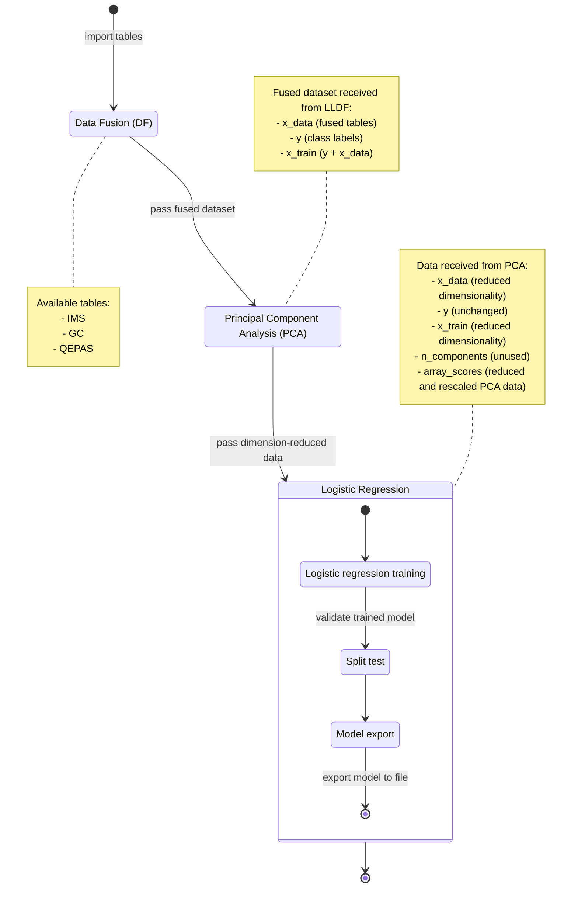

## Case study 1: fusione di dati a basso livello

### Introduzione

Questo case study mira a dimostrare l'unicità di ChemFuseKit, evidenziando il suo flusso di lavoro basato sulla fusione dei dati, che permette una predizione ed un'analisi unitaria di campioni provenienti da fonti diverse. Viene preso come esempio un insieme di dati contenente rilevazioni provenienti da tre sensori differenti. L'obiettivo è costruire un classificatore binario in grado di distinguere il dimentil-metilfosfonato (DMMP) dall'acetone.

### Metodologia 

I dati, forniti dal progetto RISEN, sono raccolti in un unico file Excel diviso in più tabelle. Tre di esse risultano utili ai fini dell'analisi. La prima contiene i dati per la spettrometria a mobilità ionica (IMS, Ion Mobility Spectroscopy), la seconda i risultati della cromatografia a gas (GC), la terza i dati raccolti tramite spettrometria fotoacustica aumentata al quarzo (QEPAS, Quart-Enhanced PhotoAcoustic Spectroscopy). IMS è una tecnica che separa e identifica ioni in base alla loro dimensione e carica; GC separa i componenti in base al tempo di ritenzione all'interno del sensore; QEPAS usa l'effetto fotoacustico per identificare tracce. Tutti e tre i sensori lavorano in fase gassosa. Entrambi gli spettrometri generano, per ogni campione, un vettore di dati nel quale ogni componente rappresenta l'intensità della risposta della sostanza analizzata in una specifica banda di lunghezze d'onda. Tali lunghezze d'onda, espresse in nanometri, fungono da nomi dell colonne nelle rispettive tabelle. Nello specifico, il sensore IMS produce un vettore a 668 componenti per ogni campione, mentre il sensore QEPAS produce un vettore a 128 componenti. Il cromatografo a gas produce un valore scalare, corrispondente al tempo di ritenzione della sostanza all'interno del sensore, espresso in millisecondi.

Il flusso dei dati assume la forma descritta di seguito. Le tabelle contenenti le rilevazioni effettuate dai tre sensori sono lette e importate nel modulo di fusione dei dati. Esso produce un nuovo insieme di dati fuso contenente una tabella con i soli regressori, una colonna con le sole etichette di classe, e una tabella completa con sia le etichette che i regressori. I dati fusi vengono trasferiti al modulo di Principal Component Analysis, che è in grado di determinare automaticamente il numero ideale di componenti principali da estrarre, in base ad un obiettivo di varianza spiegata scelto dall'utente. La tabella contenente le componenti principali estratte, insieme alle etichette dei campioni e alla tabella con etichette e regressori, viene passata al modulo di regressione logistica. Esso addestra un classificatore binario, lo valida mediante uno split test e infine lo esporta come file, permettendone il riutilizzo in analisi future. Il passaggio di verifica finale consiste nella reimportazione del modello da file e nel suo utilizzo per una prova di inferenza. Ognuna di queste fasi viene descritta separatamente di seguito.

I campioni nel dataset, da specifica del progetto RISEN, necessitano di essere controllati e allineati manualmente dall'utente. Alcuni campioni di DMMP nella tabella relativa al sensore IMS non erano correttamente ordinati per identificativo. Alcuni campioni di acetone nelle altre due tabelle erano tra loro disallineati. È stata mantenuta soltanto l'intersezione tra i dati disponibili in tutte e tre le tabelle, cancellando i dati non validi. Molti algoritmi di classificazione statistica ipotizzano la normalità dei dati entranti. I dati spettroscopici raggiungono dunque il massimo grado di utilità predittiva quando riscalati e normalizzati con SNV. Questo processo garantisce inoltre l'uniformità e la comparabilità tra campioni diversi. Possono essere applicate tecniche di preprocessamento aggiuntive, come ad esempio la smussatura di Savitski-Golay, ai fini della riduzione del rumore e del filtraggio dei valori anomali. In questo caso di studio, per minimizzare le variabili libere nell'analisi, il trattamento si limita alla normalizzazione SNV. I dati del cromatografo a gas non richiedono alcun preprocessamento, in quanto già utilizzabili nella loro forma grezza.

Il passaggio più significativo in questa analisi dimostrativa è la fusione di dati. La variante utilizzata in questo caso di studio è chiamata low-level data fusion. Le tabelle importate vengono fuse senza effettuare una selezione preliminare delle caratteristiche, contrariamente a quanto avviene nella variante mid-level, affrontata nell'esempio successivo. Il metodo impiegato per fondere le tabelle è una semplice concatenazione orizzontale, riga per riga; l'approccio alternativo, basato sul prodotto diadico tra matrici, è affrontato invece nel terzo caso di studio. Nello specifico dell'analisi corrente, il risultato è un'unica tabella che contiene, concatenate orizzontalmente, le etichette di classe, i dati dagli spettrometri IMS e QEPAS e i tempi di ritenzione del GC. La fusione per concatenazione è commutativa: l'ordine con cui vengono accostati i dati è ininfluente sui risultati delle analisi.

Il dataset fuso risulta essere caratterizzato da un'elevatissima dimensionalità, nell'ordine delle centinaia di componenti (668 + 128 + 1 = 797). Molte di esse sono altamente collineari. Questo è facilmente spiegabile considerando la natura dei dati spettrali. valori provenienti dagli spettroscopi rappresentano risposte a specifiche bande, e tali bande sono parzialmente sovrapposte. Gli spettri sono per loro natura relativamente continui, e dunque è improbabile trovare forti sbalzi tra una banda e le circostanti. Possiamo tentare di ridurre questa dimensionalità eccessiva dei dati fusi, mantenendo il massimo livello possibile di informazione utile, eseguendo la Principal Component Analysis. Si tratta di una tecnica statistica per la riduzione della dimensionalità, che opera cercando le componenti principali, ovvero le direzioni all'interno dello spazio vettoriale originale lungo le quali si distribuisce la maggior parte della varianza. La prima componente principale cattura la direzione della massima varianza nei dati, la seconda componente principale indica la direzione di massima varianza ortogonale alla prima direzione, e così via. Si può catturare la maggior parte dell'informazione utile dei dati originali, al fine di semplificarne la rappresentazione e l'analisi, scegliendo solo le prime componenti principali e utilizzandole come versori per un nuovo spazio vettoriale, nel quale riproiettare i dati originali. Ai fini della presente analisi dimostrativa, l'algoritmo è stato configurato per selezionare automaticamente il numero di componenti necessario per spiegare il 99% della varianza nei dati, imponendo un limite massimo di 10 componenti. Se l'obiettivo di varianza può essere raggiunto con meno di 10 componenti, viene tenuto quel numero minore; in caso contrario, vengono utilizzate 10 componenti. Ad analisi completa vengono eseguiti test statistici $T^2$ di Hotelling con un intervallo di confidenza del 95%.

In questo esempio, l'analisi ha determinato che 4 componenti fossero sufficienti. Dopo l'esportazione dei dati ridimensionati è po alla fase successiva. È stato scelto un modello di regressione logistica, ideale per un compito di classificazione binaria. La classe LR di ChemFuseKit, che implementa la regressione logistica, è progettata per riconoscere automaticamente i dati che le vengono forniti. Ricevendo dati provenienti da un riduttore di dimensionalità come PCA, è in grado di selezionare automaticamente la versione della tabella contenente le caratteristiche estratte. Il modello è stato configurato per eseguire la fase di addestramento, produrre i relativi grafici e infine validare il risultato tramite split testing. La matrice di confusione e il report di classificazione dimostrano un eccellente grado di classificazione nonostante le piccolissime dimensioni dell'insieme di dati di addestramento. A questo punto è possibile esportare il modello di regressione logistica come file con un metodo apposito. In futuro, necessitando di dover distinguere DMMP e acetone in un nuovo dataset, è possibile semplicemente importare il nuovo dataset, effettuare il processo di data fusion sulle sue tabelle, ridurne la dimensionalità mediante PCA, importare il modello pre-addestrato di regressione lineare, e utilizzarlo per classificare i dati. Questo processo continuo e semplificato, in cui i dati vengono trasferiti da una fase all'altra senza richiedere conversioni o adattamenti manuali, permette di classificare i campioni chimici in modo efficace e veloce.

### Risultati

Il preprocessamento dei dati è un passaggio fondamentale nel flusso di lavoro, perché assicura che campioni diversi siano uniformi e confrontabili. Nello specifico di questa analisi esemplificativa, è stato necessario controllare ed allineare manualmente i dati, e applicare normalizzazione ai dati dei due spettroscopi. Il successivo passaggio di fusione dei dati è stato l'aspetto più significativo del caso di studio, basandosi sulla più unica tra le funzionalità di ChemFuseKit. Le tre tabelle contenute nel foglio di calcolo Excel sono state concatenate orizzontalmente, permettendo di trattare i dati dei tre sensori come un unico regressore multicomponente. L'analisi PCA ha permesso di spiegare il 99% della varianza dei dati con sole quattro componenti, di cui soltanto la prima ne spiega più del 90%, tagliando drasticamente l'esagerata dimensionalità dei dati fusi, causata dall'altissima collinearità dei vettori spettrografici. La validazione mediante split testing ha suggerito un corretto addestramento del modello, nonostante il bassissimo numero di campioni disposibili, probabilmente grazie all'alta qualità dei regressori estratti con la PCA.

### Discussione

ChemFuseKit ha permesso di importare e fondere i dati, ridurne la dimensionalità, addestrare e validare su di essi un modello di regressione logistica e infine esportarlo, in meno di ottanta righe di codice Python. In altre quaranta linee è stato possibile importare un altro dataset, per effettuare la fusione, riduzione ed inferenza, basandosi sul modello caricato da file. Questo dimostra una notevole riduzione di complessità rispetto all'uso diretto di scikit-learn, che richiederebbe centinaia di righe di codice per effettuare la stessa serie di operazioni. La possibilità di raccogliere l'intero flusso di lavoro in un'unica libreria che comprenda fusione, analisi, addestramento, classificazione e produzione di grafici, unita alla possibilità di salvare tutti i prodotti intermedi delle analisi in qualunque fase, fa risaltare ChemFuseKit come una soluzione unica nel panorama della chemiometria. Le specificità dei dati utilizzati in questo esempio mettono particolarmente in risalto l'utilità della fusione dei dati unita alla riduzione di dimensionalità, ai fini di ottenere modelli di qualità anche partendo da un numero limitato di campioni di addestramento. Inoltre si rivela sensata l'idea del progetto RISEN di introdurre sistemi di fusione dei dati e di riduzione della dimensionalità direttamente nel firmware dei sensori, affinché essi producano dati fusi e ridimensionati collaborando tra di loro tramite rete.

### Conclusioni

ChemFuseKit, con il suo metodo di lavoro basato sulla fusione di dati, si rivela uno strumento valido per l'integrazione e analisi di dati proveniente da diversi sensori. Il flusso di lavoro impiegato in questo caso di studio può essere preso come modello per future analisi basate su questa libreria. Il processo proposto per il trattamento dei dati chemiometrici si dimostra snello ed efficiente. ChemFuseKit, potente ma semplice da utilizzare, offre una soluzione immediata per un ampio spettro di applicazioni, dallo studio accademico all'uso professionale in piccoli laboratori, e specialmente per l'uso forense, per cui è stata inizialmente sviluppata. Le sue buone impostazioni di default e i suoi tanti piccoli automatismi adattano facilmente i classificatori ai dati presentati, qualunque essi siano. Questo facilita la produzione di risultati senza bisogno di conoscenze specifiche e riduce il rischio di errori umani. Gli algoritmi presenti nel software provengono da scikit-learn, una nota e affidabile libreria di statistica e machine learning. Per questo, i suoi classificatori sono di alta qualità e rappresentano lo stato dell'arte per la loro precisione e ottimizzazione. ChemFuseKit non si limita  a fornire un accesso a tali algoritmi: produce un'interaccia molto più intuitiva, uniforme e interoperabile. Un altro punto di forza della libreria è la scalabilità: essa è in grado di gestire con facilità dati di dimensioni diverse riadattando il numero di componenti negli algoritmi e nei grafici. La sua interfaccia testuale, basata su script, permette la ripetibilità delle analisi, rendendo possibile l'elaborazione a lotti. ChemFuseKit, nella sua piccolezza, è uno strumento versatile e potente per l'analisi chemiometrica. La sua interfaccia semplificata e le sue caratteristiche di automazione e scalabilità la rendono una scelta competitiva sia in ambito accademico che professionale.

