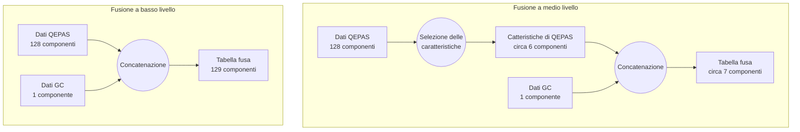

## Case study 2: fusione di dati a medio livello

### Introduzione

Due caratteristiche accomunano i documenti di ricerca sulla fusione dei dati in ambito chemiometrico. La prima, poco significativa, è l'utilizzo della fusione a fini di analisi agroalimentari. La seconda, più interessante ai fini della nostra ricerca, è l'utilizzo di un approccio di fusione di dati a medio livello, parallelamente o in sostituzione all'approccio a basso livello. La fusione a basso livello è una semplice unione delle variabili campionate per accostamento, mentre la tecnica a medio livello inizia con una fase di estrazione delle caratteristiche, individuale ad ogni sensore, seguita dalla concatenazione delle variabili estratte. Negli studi considerati, la selezione delle caratteristiche viene effettuata mediante algoritmi PCA o PLSDA. Essendo questi due algoritmi già disponibili nella libreria, durante il tardo sviluppo di ChemFuseKit è stato deciso di introdurre la tecnica di fusione a medio livello come opzione aggiuntiva. In questo esempio, le tecniche a basso e a medio livello sono state applicate agli stessi dati, per determinare i pregi e i difetti di ciascuna tecnica in casi diversi. L'obiettivo è mettere alla prova le conclusioni della letteratura analizzata, ovvero che complessivamente l'approccio a medio livello sia superiore a quello a basso livello, seppure maggiormente dipendente dalla scelta dell'algoritmo di estrazione delle caratteristiche.

### Metodologia

I dati impiegati per la costruzione di questo esempio sono stati raccolti nell'ambito del progetto RISEN. Sono raggruppati in due tabelle all'interno di un singolo foglio di calcolo. Ognuna delle due tabelle contiene 446 campioni di 17 sostanze diverse. Le sostanze sono acetone, benzaldeide, BMK, DMMP, DPGME, metilsalicilato, safrolo, acido acetico, toluene, TATP, DEMP, TMP, DES, piperidina, MEK, acido butirrico e tert-butilmetiletere. Una delle due tabelle contiene rilevazioni effettuate con uno spettrometro QEPAS (Quart-Enhanced PhotoAcoustic Spectrography). Questo tipo di rilevatore produce, per ogni campione, un vettore a 128 componenti, che rappresentano lo spettro di lunghezze d'onda comprese tra gli 8 e i 10 nanometri. I dati spettrografici del sensore QEPAS richiedono il preprocessamento con normalizzazione SNV. La seconda tabella contiene le rilevazioni di un sensore GC (Gas Chromatographer), che produce un valore scalare per ogni campione. Il numero rappresenta il tempo di ritenzione in millisecondi della sostanza, analizzata in fase gassosa, all'interno del sensore. Nella prima fase dell'analisi i dati dei due sensori vengono semplicemente concatenati, per una fusione di dati a basso livello. Nella seconda fase, sui dati viene prima effettuata l'estrazione delle caratteristiche, e successivamente le variabili estratte vengono unite per concatenazione, seguendo l'approccio di fusione a medio livello.

### Risultati

Analizziamo innanzitutto i punteggi dei modelli di regressione logistica. Se non si effettua selezione delle caratteristiche, la fusione a basso livello non produce alcuna differenza in capacità classificatorie rispetto all’uso dei soli dati del sensore QEPAS. Questo confermerebbe quanto indicato in uno studio considerato in letteratura (Borrás et al.). Una delle tesi in esso sostenute è che l’approccio di fusione a basso livello dia indesideratamente più peso ai sensori i cui dati hanno un’elevata dimensionalità, a scapito dei sensori a dimensionalità inferiore. Nello specifico di questo studio di caso, il sensore QEPAS produce un vettore di dati a 128 componenti per ogni campione, mentre il sensore GC produce un singolo scalare, e questo genera una fortissima sproporzione. Utilizzando l’algoritmo PCA, il metodo di fusione a basso livello seguito dall’estrazione delle caratteristiche si rivela significativamente peggiore sia della fusione a medio livello, che dell’uso delle caratteristiche dei soli dati QEPAS. Nel caso finale in cui si applichi l’algoritmo PLSDA, l’approccio di fusione a basso livello seguito dalla riduzione di dimensionalità si dimostra peggiore rispetto all’approccio a medio livello, ma comunque migliore rispetto ai soli dati QEPAS. I risultati della fusione a medio livello risultano leggermente peggiori, ma comunque quasi equivalenti, all’analisi dei soli dati QEPAS. Si può concludere che l’aggiunta di sensori che portino informazioni anche solo parzialmente rilevanti migliora, o lascia intatti, i risultati nel caso della fusione a medio livello. Lo stesso non si può dire dell’approccio di fusione a basso livello. Esso si è dimostrato peggiore rispetto all’approccio a medio livello in tutti i casi considerati, e in alcune istanze addirittura controproducente.

\tiny
|            | Nessuna selezione delle caratteristiche | PCA a posteriori | PLSDA a posteriori | Fusione a medio livello mediante PCA | Fusione a medio livello mediante PLSDA |
|------------|-----------------------------------------|------------------|--------------------|--------------------------------------|----------------------------------------|
| Solo QEPAS | 0.970                                   | 0.933            | 0.815              | *non definita*                       | *non definita*                         |
| QEPAS + GC | 0.970                                   | 0.793            | 0.859              | 0.926                                | 0.911                                  |

: Confronto tra punteggi di classificazione LR in seguito a diverse tecniche di fusione.

\normalsize
Passiamo ora all’analisi dei punteggi dei modelli k-NN. Se non si effettua selezione delle caratteristiche, la fusione a basso livello produce un risultato significativamente migliore rispetto all’uso dei soli dati del sensore QEPAS. La situazione cambia applicando l’algoritmo PCA. La fusione a basso livello seguita dall’estrazione delle caratteristiche produce un modello peggiore rispetto a quello ottenuto dalle caratteristiche dei soli dati QEPAS. La situazione si ribalta nuovamente applicando l’algoritmo PLSDA. Il modello ottenuto dalla fusione dei dati seguita da estrazione delle caratteristiche si dimostra migliore rispetto all’uso dei soli dati QEPAS. I risultati della fusione a medio livello risultano invece grossomodo equivalenti, o migliori, rispetto a quelli della fusione a basso livello, con entrambi gli algoritmi di estrazione delle caratteristiche. La fusione dei dati a basso livello senza estrazione delle caratteristiche, la fusione a basso livello seguita da estrazione PLSDA e la fusione a medio livello per mezzo di estrazione PCA producono modelli equivalenti. In questo caso, insomma, la fusione a medio livello si dimostra comparabile alla fusione a basso livello, anche se non sempre migliore, e potrebbe dunque essere usata come opzione predefinita senza eccessivi rischi.

\tiny
|            | Nessuna selezione delle caratteristiche | PCA a posteriori | PLSDA a posteriori | Fusione a medio livello mediante PCA | Fusione a medio livello mediante PLSDA |
|------------|-----------------------------------------|------------------|--------------------|--------------------------------------|----------------------------------------|
| Solo QEPAS | 0.896                                   | 0.935            | 0.830              | *non definita*                       | *non definita*                         |
| QEPAS + GC | 0.948                                   | 0.925            | 0.948              | 0.948                                | 0.941                                  |

: Confronto tra punteggi di classificazione kNN in seguito a diverse tecniche di fusione.

### Discussione

\normalsize
I risultati ottenuti dai diversi approcci di fusione dei dati mostrano l’utilità di lasciare la fusione a medio livello come opzione selezionabile dall’utente. Il successo di una tecnica di fusione o dell’altra, fissata la variabile dei dati originali, si dimostra ampiamente dipendente dalla tecnica di classificazione scelta. Questa osservazione è in linea con i risultati di altri studi che hanno confrontato i due approcci. È importante notare che l’approccio di mid-level data fusion richiede una corretta strutturazione della fase di selezione delle caratteristiche per ogni tabella. Questo passaggio può richiedere una certa esperienza e conoscenza dei dati. In questa libreria il problema è parzialmente risolto dall’implementazione di un sistema automatico del numero ottimale di caratteristiche. Esso si basa sulla varianza spiegata cumulativa nel caso dell’analisi PCA, e sulla crossvalidazione nel caso dell’analisi PLSDA. Sempre in linea con la letteratura considerata, osserviamo il problema della diluizione dei dati di sensori a bassa dimensionalità da parte dei dati di sensori a dimensionalità più alta. Questo è particolarmente evidente nell’esempio con regressione logistica, e porta ad una riduzione della precisione dell’analisi. L’uso di tecniche di riduzione della dimensionalità, come PCA o PLSDA, può aiutare a mitigare questo problema. Concludiamo reiterando che i risultati variano significativamente a seconda del metodo di classificazione utilizzato.

### Conclusioni

I risultati di questo caso di studio mostrano che l’approccio di fusione a medio livello possa rivelarsi generalmente migliore o equivalente all’approccio di fusione a basso livello. Questo risultato è particolarmente evidente in seguito alla classificazione mediante regressione logistica. È fondamentale ricordare che i risultati variano significativamente a seconda del metodo di classificazione utilizzato, e dell’applicazione o non applicazione di tecniche di selezione delle caratteristiche. In particolare, l’approccio di fusione a basso livello può risultare controproducente rispetto all’analisi di dati di un solo sensore, quando le uscite dei rilevatori hanno una forte disparità di dimensionalità. Questo fenomeno, di nuovo, è particolarmente evidente nei risultati dell’analisi con regressione logistica. In generale, l’aggiunta di sensori che forniscano informazioni aggiuntive, anche solo parzialmente rilevanti, può migliorare o mantenere i risultati della fusione a medio livello. Questo non è necessariamente vero nel caso della fusione a basso livello. Pertanto, al momento della scelta dell’approccio per la fusione dei dati, è importante considerare attentamente il tipo di sensori e il metodo di classificazione utilizzato. Per avere risultati più precisi e conclusivi, sarebbe utile ripetere le analisi per tutti i tipi di classificatori presenti nella libreria.

