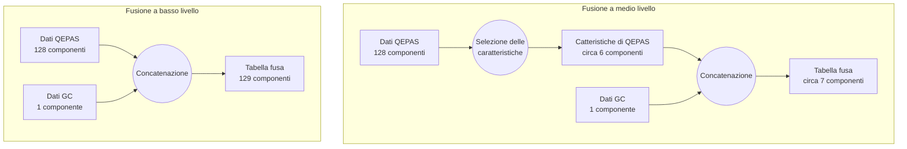

## Case study 2: fusione di dati a medio livello

### Introduzione

Due caratteristiche accomunano i documenti di ricerca sulla fusione dei dati in ambito chemiometrico. La prima, poco significativa, è l'utilizzo della fusione a fini di analisi agroalimentari. La seconda, più interessante ai fini della nostra ricerca, è l'utilizzo di un approccio di fusione di dati a medio livello, parallelamente o in sostituzione all'approccio a basso livello. La fusione a basso livello è una semplice unione delle variabili campionate per accostamento, mentre la tecnica a medio livello inizia con una fase di estrazione delle caratteristiche, individuale ad ogni sensore, seguita dalla concatenazione delle variabili estratte. Negli studi considerati, la selezione delle caratteristiche viene effettuata mediante algoritmi PCA o PLSDA. Essendo questi due algoritmi già disponibili nella libreria, durante il tardo sviluppo di ChemFuseKit è stato deciso di introdurre la tecnica di fusione a medio livello come opzione aggiuntiva. In questo esempio, le tecniche a basso e a medio livello sono state applicate agli stessi dati, per determinare i pregi e i difetti di ciascuna tecnica in casi diversi. L'obiettivo è mettere alla prova le conclusioni della letteratura analizzata, ovvero che complessivamente l'approccio a medio livello sia superiore a quello a basso livello, seppure maggiormente dipendente dalla scelta dell'algoritmo di estrazione delle caratteristiche.

### Metodologia

I dati impiegati per la costruzione di questo esempio sono stati raccolti nell'ambito del progetto RISEN. Sono raggruppati in due tabelle all'interno di un singolo foglio di calcolo. Ognuna delle due tabelle contiene 446 campioni di 17 sostanze diverse. Le sostanze sono acetone, benzaldeide, BMK, DMMP, DPGME, metilsalicilato, safrolo, acido acetico, toluene, TATP, DEMP, TMP, DES, piperidina, MEK, acido butirrico e tert-butilmetiletere. Una delle due tabelle contiene rilevazioni effettuate con uno spettrometro QEPAS (Quart-Enhanced PhotoAcoustic Spectrography). Questo tipo di rilevatore produce, per ogni campione, un vettore a 128 componenti, che rappresentano lo spettro di lunghezze d'onda comprese tra gli 8 e i 10 nanometri. I dati spettrografici del sensore QEPAS richiedono il preprocessamento con normalizzazione SNV. La seconda tabella contiene le rilevazioni di un sensore GC (Gas Chromatographer), che produce un valore scalare per ogni campione. Il numero rappresenta il tempo di ritenzione in millisecondi della sostanza, analizzata in fase gassosa, all'interno del sensore. Nella prima fase dell'analisi i dati dei due sensori vengono semplicemente concatenati, per una fusione di dati a basso livello. Nella seconda fase, sui dati viene prima effettuata l'estrazione delle caratteristiche, e successivamente le variabili estratte vengono unite per concatenazione, seguendo l'approccio di fusione a medio livello.

### Risultati

### Discussione

I risultati ottenuti dai diversi approcci di fusione dei dati mostrano l’utilità di lasciare la fusione a medio livello come opzione selezionabile dall’utente. Il successo di una tecnica di fusione o dell’altra, fissata la variabile dei dati originali, si dimostra ampiamente dipendente dalla tecnica di classificazione scelta. Questa osservazione è in linea con i risultati di altri studi che hanno confrontato i due approcci. È importante notare che l’approccio di mid-level data fusion richiede una corretta strutturazione della fase di selezione delle caratteristiche per ogni tabella. Questo passaggio può richiedere una certa esperienza e conoscenza dei dati. In questa libreria il problema è parzialmente risolto dall’implementazione di un sistema automatico del numero ottimale di caratteristiche. Esso si basa sulla varianza spiegata cumulativa nel caso dell’analisi PCA, e sulla crossvalidazione nel caso dell’analisi PLSDA. Sempre in linea con la letteratura considerata, osserviamo il problema della diluizione dei dati di sensori a bassa dimensionalità da parte dei dati di sensori a dimensionalità più alta. Questo è particolarmente evidente nell’esempio con regressione logistica, e porta ad una riduzione della precisione dell’analisi. L’uso di tecniche di riduzione della dimensionalità, come PCA o PLSDA, può aiutare a mitigare questo problema. Concludiamo reiterando che i risultati variano significativamente a seconda del metodo di classificazione utilizzato.

### Conclusioni

