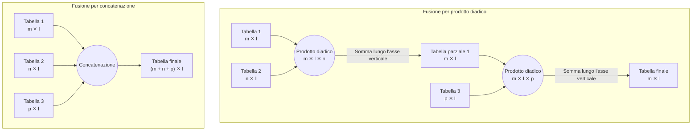

## Case study 3: fusione di dati tramite prodotto matriciale diadico

### Introduzione

In questo studio di caso è messo alla prova il metodo per la fusione di dati basato sulla motliplicazione diadica tra matrici. Questa tecnica è valutata come alternativa all’usuale approccio alla fusione per concatenazione di tabelle. Il nuovo metodo dovrebbe, secondo quanto presentato in letteratura, dare un peso più uniforme a dati di dimensionalità diverse. Si valuta l’efficacia di questo metodo come alternativa e come complemento alla fusione a medio livello. La nuova tecnica dovrebbe risolvere parzialmente i problemi ricorrenti della fusione a basso livello. Questi problemi includono la diluizione dei dati dei sensori a bassa dimensionalità da parte dei dati di sensori ad alta dimensionalità, e l'aumento sproporzionato del rumore a scapito del segnale.

### Metodologia

I dati utilizzati in questo esempio sono gli stessi dello studio di caso precedente. Contengono due tabelle, una di rilevazioni effettuate con un sensore QEPAS, e l’altra con rilevazioni di un sensore GC. Ogni tabella contiene 446 campioni di 17 possibili sostanze diverse. I dati del sensore QEPAS sono vettori a 128 componenti, e rappresentano la risposta spettrale dei campioni nelle bande tra gli 8 nm e i 10 nm. I dati del sensore QEPAS sono vettori a 128 componenti, e rappresentano la risposta spettrale dei campioni nelle bande tra gli 8 nm e i 10 nm. I dati del sensore GC constano di un valore scalare per ogni campione, il quale rappresenta il tempo di ritenzione del campione gassoso all’interno del sensore. I dati spettrografici del sensore QEPAS necessitano di preprocessamento via normalizzazione SNV. Nella prima fase dell’analisi, i dati vengono fusi a basso livello, ovvero senza estrazione preliminare delle caratteristiche. Nella seconda fase, un passaggio di selezione delle caratteristiche viene anteposta alla fusione, in un approccio a medio livello. Per entrambe le fasi, ogni operazione di fusione è ripetuta sia nella variante concatenatoria che in quella diadica.

Si confrontino ora i due approcci di fusione. Il metodo più semplice e intuitivo per unire i dati provenienti da due diversi sensori è concatenarli riga per riga. Ogni sensore produce una tabella dove ogni riga rappresenta un campione e ogni colonna è una componente di tale campione. Possiamo concatenare lateralmente tabelle provenienti da diversi sensori, se il numero di campioni è lo stesso e ogni riga si riferisce alla stessa rilevazione. Otteniamo una tabella fusa contenente lo stesso numero di campioni delle tabelle originali. Il numero delle sue colonne è pari alla somma di tutte le componenti di tutti i sensori dei quali stiamo fondendo i dati. Questa tecnica è utilizzata da quasi tutti gli studi considerati. Il suo difetto principale è l’eccessivo aumento di dimensionalità. Come spiegato nello studio di caso riguardante la fusione a medio livello, questo fenomeno può causare un aumento del rumore senza apportare vero segnale. Il secondo difetto è la predominanza dei sensori ad alta dimensionalità sui sensori a bassa dimensionalità. Un documento di ricerca sull’analisi delle pesce (Di Natale et al.) propone una tecnica alternativa alla concatenazione, basata sul prodotto diadico tra matrici, che risolve parzialmente questi problemi.

Il prodotto diadico tra matrici può essere visualizzato come operazione tridimensionale. Le due matrici da moltiplicare sono poste come facce contigue di un parallelepipedo. La lunghezza dello spigolo in comune rappresenta il numero di campioni nelle due tabelle. Il valore di ogni cella tridimensionale nel parallelepipedo corrisponde al prodotto dei valori delle celle bidimensionali che sono sue proiezioni sui lati lungo gli assi verticali e orizzontali. In altre parole, all’incrocio delle normali di due celle dei lati contenenti le matrici, si trova una cella tridimensionale il cui valore è il prodotto delle due celle bidimensionali. Il risultato dell’operazione è dunque una matrice tridimensionale, che ha per larghezza l’ampiezza della prima matrice, per lunghezza il numero di campioni di entrambe, e per altezza l’ampiezza della seconda matrice. Alcuni metodi di regressione, come ad esempio PLSDA, sono in grado di interpretare dati bidimensionali. Di conseguenza, sezioni bidimensionali della matrice possono essere usate come campioni. Alternativamente, la matrice tridimensionale può essere collassata a matrice bidimensionale, sommando i suoi valori lungo un asse. Nel caso di questo progetto, sommiamo sempre lungo le colonne verticali, per ottenere una matrice che abbia le stesse dimensioni della prima matrice operanda. Il vantaggio di questo approccio basato sul prodotto diadico è che i valori della tabella fusa rappresentano una sorta di media pesata tra i sensori.

Siano $A$ e $B$ le due matrici. $A$ è di dimensioni $(m \times l)$ e $B$ è di dimensioni $(n \times l)$, il prodotto diadico si definisce in questo modo:
$$ A \otimes B = C, \quad C~(m \times l \times n) $$
$$ C_{i,j,k} = A_{i,j} \times B_{j, k}. $$
Successivamente, nella variante utilizzata nella libreria, si sommano tutti i valori in ogni colonna lungo l'asse verticale:
$$ C(m \times l \times n) \to D(m \times l): $$
$$ D_{i,j} = \sum_{k=1^n} C_{i,j,k}. $$

La moltiplicazione diadica tra matrici, seguita da una somma lungo un asse, non è un’operazione commutativa. Cambiare l’ordine delle matrici da fondere porta a risultati diversi, al contrario della fusione concatenatoria, dove invece l’ordine delle tabelle è ininfluente. L’operazione è binaria e associativa ma non commutativa. L’algoritmo è sequenziale, al contrario della concatenazione che è parallela, almeno a livello logico. La tabella fusa assume le stesse dimensioni della prima tabella nell’operazione. La scelta di quale tabella porre per prima nell’operazione influenza la dimensione finale del risultato. In ChemFuseKit, per la fusione di più tabelle con questo metodo, si calcola prima il prodotto diadico tra le prime due, e successivamente del loro risultato con la terza tabella. Dopodiché, il risultato della seconda fusione è moltiplicato per la quarta tabella, e così via. Si potrebbero sviluppare algoritmi migliori, che portino a risultati meno approssimati lavorando in più dimensioni. Questo eviterebbe l'espansione e la successiva riduzione delle dimensioni ad ogni passaggio. Per il momento, ChemFuseKit offrirà solo questa versione semplificata dell'algoritmo.

### Risultati

Analizziamo in questo paragrafo i risultati dell'esperimento basato sulla regressione logistica *one versus rest*. Il classificatore che utilizza dati fusi a basso livello per concatenazione ottiene un punteggio identico a quello che utilizza i soli dati del sensore QEPAS. Potrebbe trattarsi di un esempio della problematica di diluizione dei dati presentata in letteratura. Al contrario, la fusione a basso livello basata sul prodotto diadico produce un significativo miglioramento rispetto al solo QEPAS, producendo un ottimo classificatore. L'algoritmo di regressione logistica multivariata sembra in grado di gestire aproblematicamente un ampio numero di regressori. Conseguentemente, ogni operazione di selezione delle caratteristiche tende a produrre modelli meno efficaci rispetto all'utilizzo di dati non ridotti. Tenendo in mente questa considerazione, affrontiamo di seguito i casi in cui venga utilizzata l'estrazione delle caratteristiche. Non inaspettatamente, il modello addestrato sulle caratteristiche estratte dai soli dati QEPAS è sensibilmente peggiore rispetto alla versione addestrata sui dati grezzi. Si analizzi ora il penultimo caso, ovvero l'estrazione delle caratteristiche come passaggio successivo alla fusione a basso livello. Il modello addestrato sulle caratteristiche estratte dai dati fusi per concatenazione è peggiore rispetto al modello basato sulle caratteristiche estratte dai soli dati QEPAS. Il modello con la qualità massima, tra quelli basati sull'estrazione delle caratteristiche, è addestrato sulle variabili estratte dai dati fusi a basso livello per prodotto diadico. Il risultato è significativamente migliore sia del modello addestrato sulle caratteristiche di QEPAS, che del modello addestrato sulle caratteristiche dei dati fusi a basso livello per concatenazione. Nel caso finale si applica la fusione a medio livello. In questo frangente, il modello ottenuto dai dati fusi per prodotto diadico risulta superiore rispetto al modello ottenuto per concatenazione, ma peggiore rispetto al suo equivalente ottenuto dalle caratteristiche estratte dai dati fusi a basso livello. Il modello ottenuto per concatenazione nella fusione a medio livello risulta invece migliore del suo equivalente ottenuto dall'estrazione delle caratteristiche post-fusione a basso livello.

|                              | Nessuna selezione delle caratteristiche | PCA a posteriori | Fusione a medio livello mediante PCA |
|------------------------------|-----------------------------------------|------------------|--------------------------------------|
| Solo QEPAS                   | 0.97037                                 | 0.84444          | *non definita*                       |
| Fusione per concatenazione   | 0.97037                                 | 0.79259          | 0.92592                              |
| Fusione per prodotto diadico | 0.97777                                 | 0.94074          | 0.93333                              |

: Punteggi di classificazione LR (*split test* 70/30) a seguito di diverse tecniche di fusione.

Consideriamo ora i risultati relativi alla classificazione k-Nearest Neighbors. I modelli addestrati sui dati fusi producono una classificazione migliore rispetto al modello addestrato sui soli dati QEPAS, per entrambe le tecniche di fusione a basso livello, ovvero concatenazione e prodotto diadico. Tenuto questo in considerazione, il modello addestrato sui dati concatenati si dimostra superiore rispetto al modello addestrato sui dati moltiplicati diadicamente. Si consideri ora il gruppo di analisi con procedure di estrazione delle caratteristiche. Il modello addestrato sulle caratteristiche estratte dai dati QEPAS è leggermente peggiore, ma non significativamente, rispetto al corrispettivo addestato sui dati grezzi. Anche in questo frangente i risultati dell’addestramento su dati fusi a basso livello si rivelano migliori rispetto all’addestramento sui soli dati QEPAS. Si mantiene il primato dei risultati ottenuti dai dati concatenati rispetto ai dati fusi per prodotto diadico. Entrambi i risultati sono leggermente peggiori rispetto ai casi equivalenti senza fusione, in linea con quanto osservato per i modelli basati sui soli dati QEPAS. La categoria che presenta i risultati complessivamente migliori risulta essere quella basata sulla fusione a medio livello. Anche in quest’ultimo versante l’approccio per concatenazione vince sull’approccio per prodotto diadico. Il risultato di quest’ultimo è però comparabile a quello del modello addestrato sulle caratteristiche dei dati fusi per concatenazione, affrontato nel caso precedente. I punteggi del modello addestrato sui dati concatenati si rivelano invece comparabili ai risutlati del modello ottenuto per fusione a basso livello nel caso equivalente. Si può affermare che la fusione a medio livello sia l’approccio più sicuro per preparare i dati alla classificazione kNN, perché essa produce risultati equivalenti o migliori rispetto ai risultati di tutti gli altri casi.

|                              | Nessuna selezione delle caratteristiche | PCA a posteriori | Fusione a medio livello mediante PCA |
|------------------------------|-----------------------------------------|------------------|--------------------------------------|
| Solo QEPAS                   | 0.89629                                 | 0.88888          | *non definita*                       |
| Fusione per concatenazione   | 0.94814                                 | 0.92592          | 0.94814                              |
| Fusione per prodotto diadico | 0.91851                                 | 0.91851          | 0.92592                              |

: Punteggi di classificazione kNN (*split test* 70/30) a seguito di diverse tecniche di fusione.

Si consideri infine il caso con classificazione LDA. In esso, i risultati cambiano significativamente a seconda del metodo utilizzato per decidere il numero di componenti. L’algoritmo LDA prevede un passaggio di estrazione delle caratteristiche. Esso non possiede capacità intrinseche per la scelta del numero di caratteristiche da estrarre. Di conseguenza, questa scelta deve essere affidata ad un algoritmo esterno. Uno dei metodi possibili per la scelta del numero di componenti è la validazione incrociata a cinque pieghe. Quando applicata ai dati di questo esempio, essa produce un classificatore LDA monocomponente. Tutte le varianti del modello, ad eccezione di quella addestrata sui dati fusi per concatenazione a basso livello, risultano significativamente peggiori rispetto al modello ottenuto dai soli dati QEPAS. L’applicazione della riduzione di dimensionalità in seguito alla fusione a basso livello produce risultati equivalenti tra la variante concatenata e la variante diadica. Nel caso della fusione a medio livello l’approccio migliore è invece quello di fusione per prodotto diadico, con una differenza significativa rispetto alla fusione per concatenazione. Per la scelta del numero di componenti, un metodo alternativo alla validazione incrociata è l’analisi PCA. Utilizzando questo secondo approccio, tutti i modelli ottenuti si dimostrano inferiori al classificatore addestrato sui dati QEPAS non ridimensionati. Quest’ultimo raggiunge infatti risultati perfetti, classificando correttamente tutti i campioni dell’insieme di validazione. La fusione a basso livello produce risultati equivalenti con entrambe le tecniche di concatenazione e prodotto diadico. Lo stesso avviene per l’approccio a medio livello, che tuttavia risulta complessivamente il caso peggiore tra quelli considerati. Tra i modelli addestrati su dati ridimensionati, il migliore è ottenuto dalla fusione diadica a basso livello seguita dall’estrazione delle caratteristiche.

\tiny
|                              | Nessuna selezione delle caratteristiche | PCA a posteriori | Fusione a medio livello mediante PCA |
|------------------------------|-----------------------------------------|------------------|--------------------------------------|
| Solo QEPAS                   | 0.80000                                 | 0.73333          | *non definita*                       |
| Fusione per concatenazione   | 0.81481                                 | 0.68148          | 0.62962                              |
| Fusione per prodotto diadico | 0.7037                                  | 0.68148          | 0.72592                              |

: Punteggi di classificazione LDA (*split test* 70/30), a seguito di diverse tecniche di fusione. Componenti LDA scelte per validazione incrociata.

|                              | Nessuna selezione delle caratteristiche | PCA a posteriori | Fusione a medio livello mediante PCA |
|------------------------------|-----------------------------------------|------------------|--------------------------------------|
| Solo QEPAS                   | 1                                       | 0.92592          | *non definita*                       |
| Fusione per concatenazione   | 0.99259                                 | 0.90370          | 0.8888                               |
| Fusione per prodotto diadico | 0.99259                                 | 0.94074          | 0.8888                               |

: Punteggi di classificazione LDA (*split test* 70/30), a seguito di diverse tecniche di fusione. Componenti LDA scelte tramite analisi PCA.

### Discussione

\normalsize
I risultati dello studio di caso sulla fusione dei dati tramite prodotto matriciale diadico, seppur fortemente influenzati dalla scelta del classificatore utilizzato in seguito, rivelano alcune informazioni significative. Innanzitutto, viene mostrato che in alcuni casi l’approccio di fusione diadica presenta alcuni vantaggi rispetto alla concatenazione, una conclusione non scontata, vista la natura poco intuitiva dell’operazione. Nel caso della regressione logistica, la fusione diadica a basso livello senza riduzione di dimensionalità si è dimostrata l’approccio migliore. Questo risultato suggerisce che l’approccio diadico sia in grado di gestire efficacemente un ampio numero di regressori, senza la necessità di estrarre le caratteristiche dei dati. Volendo invece impiegare la riduzione di dimensionalità, la sua applicazione in seguito alla fusione diadica a basso livello produce risultati migliori rispetto alla fusione a medio livello, diadica o concatenata che sia. I risultati cambiano quando si utilizza un classificatore k-Nearest Neighbors. In questo caso, la fusione a basso livello senza riduzione di dimensionalità e la fusione a medio livello sono equivalenti, se applicate nella variante concatenatoria. La fusione diadica, invece, si è dimostrata meno efficace rispetto alla concatenazione, indipendentemente dagli altri parametri utilizzati. Infine, nel caso del classificatore LDA, il miglior modello a dimensionalità ridotta dipende dal numero di componenti utilizzate nel modello. In generale, la fusione diadica a basso livello seguita dall’estrazione delle caratteristiche ha prodotto alcuni dei migliori risultati tra i modelli addestrati su dati ridimensionati, senza mai risultare significativamente peggiore rispetto ad altri approcci. I risultati dello studio di caso suggeriscono dunque che l’approccio di fusione diadica possa essere un’alternativa valida alla concatenazione, e addirittura equivalente o superiore alla fusione a medio livello in alcuni frangenti.

### Conclusioni

L'approccio di fusione migliore per l'analisi con regressione logistica sui dati QEPAS + GC è la fusione a basso livello per prodotto diadico, senza riduzione di dimensionalità. Se dovesse essere necessaria una selezione delle caratteristiche, l’approccio migliore è la sua applicazione dopo la fusione diadica a basso livello. La situazione cambia utilizzando un classificatore k-Nearest Neighbors. La fusione a basso livello senza riduzione di dimensionalità e la fusione a medio livello sono equivalenti, se applicate nella variante concatenatoria. La fusione diadica risulta sempre peggiore, a parità di tutti gli altri parametri. Utilizzando un classificatore LDA, il migliore modello a dimensionalità ridotta dipende invece dal numero di componenti utilizzate nel modello. L’analisi è complessivamente inconclusiva, seppure si possano trovare degli schemi validi sui singoli classificatori. Questo dimostra l'importanza di lasciare all'utente la possibilità di scegliere tra più approcci in base al contesto dell'analisi.

