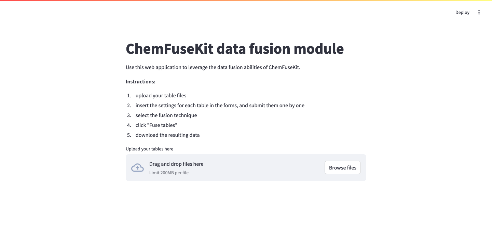
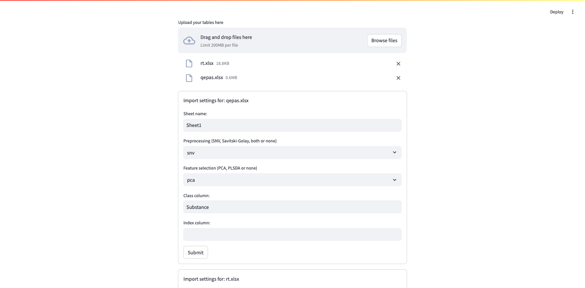
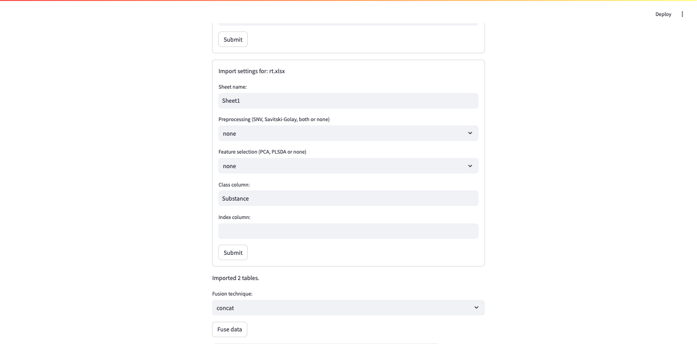
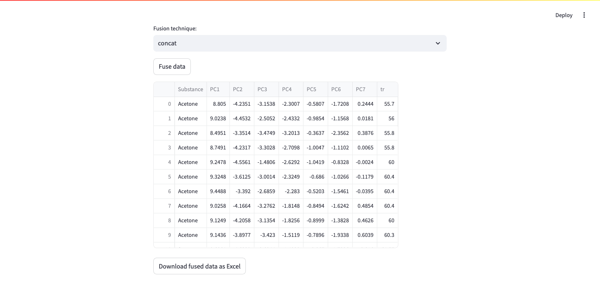
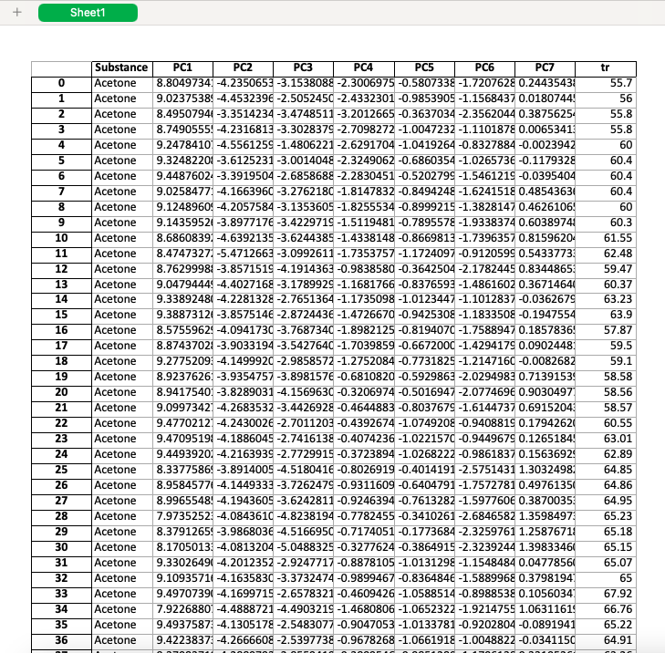

## Case study 4: costruzione di un'interfaccia grafica per la fusione di dati

### Introduzione

Uno degli obiettivi originali per la costruzione di ChemFuseKit, poi eliminato, era la costruzione di una web app per la fusione e l’analisi dei dati, ispirata dal progetto Spectra dell’Università di Torino. ChemFuseKit è stata costruita pensando all’uso via Jupyter Notebook o da terminale, ma la possibilità di costruire un’interfaccia grafica non è mai stata completamente rimossa. Ad esempio, l’ultima ristrutturazione dell’architettura della libreria ha introdotto dei cambiamenti fondamentali per aprire la strada ad un progetto di questo tipo. L’interfaccia delle classi è stata rivista per renderla più uniforme e strutturata, aprendo maggiori possibilità di controllo tramite librerie esterne. È stato inoltre introdotto un sistema di salvataggio dei risultati e dei dati dai quali vengono istanziati i grafici, che, in un nuovo passaggio intermedio, vengono inseriti in un dizionario Python invece di essere stampati immediatamente. Questo permette di deferire il processamento dell’output, separando gli ambiti tra l’analisi dei dati e la produzione dei report, in modo che quest’ultima fase possa essere portata avanti da un’interfaccia grafica separata. Un effetto secondario della modifica è lo snellimento del codice di classificatori e riduttori. l sistema basato sui dizionari apre anche la strada alla produzione di report grafici come PDF da linea di comando, senza l’obbligo di affidarsi ad un’interfaccia grafica o ai notebook.

### Metodologia

È stato scelto di impiegare la libreria Streamlit per la costruzione dell’interfaccia grafica in questo esempio. Si tratta di una libreria *open source* per trasformare script per l’analisi di dati in web app facilmente condivisibili, programmate in puro Python, senza che sia necessaria esperienza nel web development. Il design grafico, la disponibilità di componenti specifici e il loro aspetto estetico sono già definiti dalla libreria. Il caricamento di file è semplice, e permette di passare tabelle all’applicazione con estrema facilità. I componenti di Streamlit permettono la visualizzazione grafica di strutture dati basate su DataFrame della libreria Pandas, come quelle contenute in ChemFuseKit. Il processo di design dell’interfaccia è dunque puramente incentrato sull’ambito funzionale. Al programmatore è soltanto richiesto di decidere cosa inserire nella pagina, e come utilizzare i componenti grafici per invocare le funzionalità dei propri script o delle proprie librerie. Questo permette la prototipazione di web app complete con estrema rapidità, e rende la creazione dell’interfaccia un pensiero secondario in progetti, come questo, in cui la parte fondamentale riguarda l’elaborazione dei dati.

Il codice complessivo dell'applicazione, brevissimo e di facile lettura, è il seguente:

\tiny
```python
"""
# Data fusion

A graphical user interface for the data fusion module in `ChemFuseKit`.
"""

import streamlit as st
from chemfusekit.df import Table, DFSettings, DF
from io import BytesIO
import pandas as pd

st.title("ChemFuseKit data fusion module")

st.markdown(f"""
Use this web application to leverage the data fusion abilities of ChemFuseKit.

**Instructions:**
1. upload your table files
2. insert the settings for each table in the forms, and submit them one by one
3. select the fusion technique
4. click "Fuse tables"
5. download the resulting data
""")

tables = st.file_uploader(label="Upload your tables here", accept_multiple_files=True)

if "tabled_tables" not in st.session_state:
    st.session_state.tabled_tables = []

for table in tables:
    file = BytesIO(table.read())
    with st.form(f"Form for table {table}"):
        st.markdown(f"Import settings for: {table.name}")
        if table.name.endswith(".xlsx"):
            sheet_name = st.text_input("Sheet name: ")
        else:
            sheet_name = 'none'
        preprocessing = st.selectbox(
            "Preprocessing (SNV, Savitski-Golay, both or none)",
            ("snv", "savgol", "savgol+snv", "none"))
        feature_selection = st.selectbox(
            "Feature selection (PCA, PLSDA or none)",
            ("pca", "plsda", "none"))
        class_column = st.text_input("Class column: ")
        index_column = st.text_input("Index column: ")
        submitted = st.form_submit_button("Submit")

        if submitted:
            st.session_state.tabled_tables.append(Table(
                file_path=file,
                sheet_name=sheet_name if sheet_name != '' else 'Sheet1',
                preprocessing=preprocessing,
                feature_selection=feature_selection if feature_selection != 'none' else None,
                class_column=class_column if class_column != '' else 'Substance',
                # index_column=index_column
            ))

if len(tables) > 0:
    st.markdown(f"Imported {len(st.session_state.tabled_tables)} tables.")

if len(st.session_state.tabled_tables) > 0:
    fusion_type = st.selectbox(
            "Fusion technique: ",
            ("concat", "outer"))

    if st.button("Fuse data"):
        df = DF(DFSettings(output='none', method=fusion_type), st.session_state.tabled_tables)
        df.fuse()
        df.fused_data.x_train

        buffer = BytesIO()
        with pd.ExcelWriter(buffer, engine='xlsxwriter') as writer:
            # Write each dataframe to a different worksheet.
            df.fused_data.x_train.to_excel(writer, sheet_name='Sheet1')

            # Close the Pandas Excel writer and output the Excel file to the buffer
            writer.close()

            st.download_button(
                label="Download fused data as Excel",
                data=buffer,
                file_name="fused_data.xlsx",
                mime="application/vnd.ms-excel"
            )
```

\normalsize
L'applicazione si avvia presentando una semplice lista delle istruzioni, e un bottone per caricare le tabelle.



Dopodiché viene reso possibile selezionare tramite una form le impostazioni per le singole tabelle da importare.



Successivamente si possono scegliere le opzioni per la fusione, e avviarla.



I risultati della fusione sono visualizzabili direttamente nell'applicazione.



A fusione eseguita, è possibile scaricare il file XLSX contenente i dati fusi. Il contenuto del file mantiene la struttura visualizzata nell'anteprima all'interno dell'applicazione.



### Risultati

### Discussione

### Conclusioni

